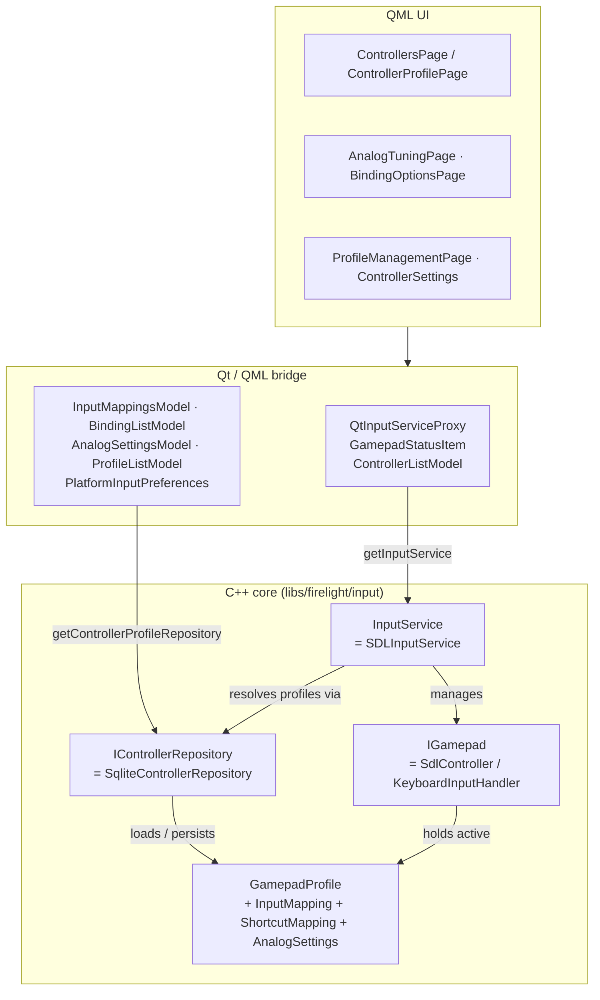
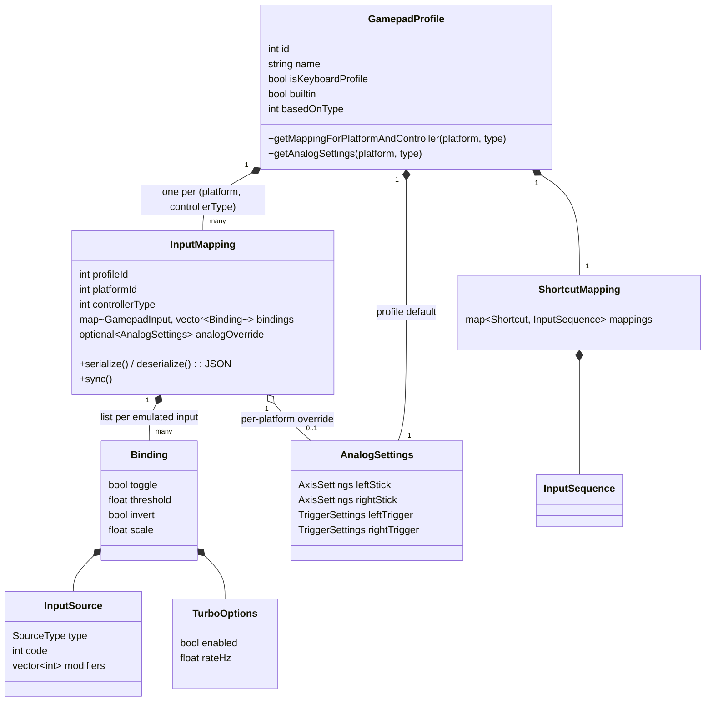
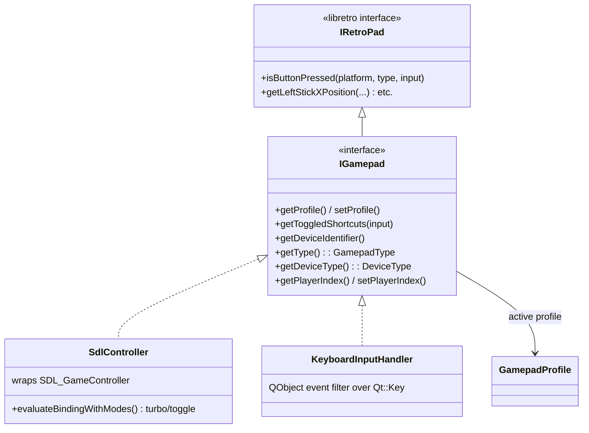
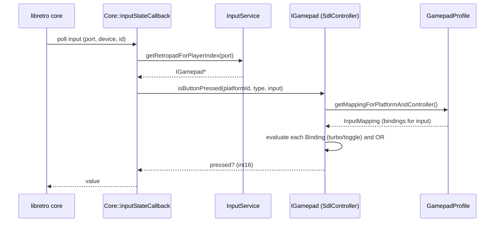

# Input Module

This document explains the data structures, interfaces, and classes that make up
Firelight's input system, how they relate, and how they're used from the
player's point of view.

The module lives in three places:

| Location | Contains |
|---|---|
| `libs/firelight/input/` | The domain model + runtime (the `firelight_input` static lib). Pure C++/SDL/Qt-core, no QML. |
| `src/app/input/gui/` | Qt list-models that back the QML configuration screens. |
| `src/gui/` | A few extra Qt bridge objects (`QtInputServiceProxy`, `GamepadProfileItem`, `ShortcutsModel`). |

---

## 1. Layered overview



Two global accessors connect the layers (`src/app/service_accessor.hpp`):
`ServiceAccessor::getInputService()` (the live runtime) and
`getControllerProfileRepository()` (persistence). Both singletons are set once in
`main.cpp`.

---

## 2. The vocabulary — plain value types

All under `libs/firelight/input/include/firelight/input/`.

| Type | File | What it is |
|---|---|---|
| `GamepadInput` (enum) | `gamepad_input.hpp`* | The **emulated** inputs a libretro core reads — `SouthFace`, `DpadUp`, `LeftStickUp`, … Values match `RETRO_DEVICE_ID_JOYPAD_*`. This is the *target* vocabulary. |
| `GamepadType` (enum) | `gamepad_type.hpp` | The hardware model: `MICROSOFT_XBOX_ONE`, `NINTENDO_NSO_N64`, … |
| `DeviceType` (enum) | `gamepad_type.hpp` | Broad class of device: `Gamepad` or `Keyboard`. |
| `InputSource` + `SourceType` | `input_source.hpp` | **What a binding physically reads from**: a `type` (Button / AxisPositive / AxisNegative / Key), a `code` (a `GamepadInput` for a pad, a `Qt::Key` for the keyboard), and optional `modifiers` (held combo inputs). |
| `Binding` + `TurboOptions` | `binding.hpp` | An `InputSource` **plus behavior**: `toggle`, `turbo{enabled, rateHz}`, analog→digital `threshold`, `invert`, `scale`. |
| `AnalogSettings` (`AxisSettings`, `TriggerSettings`) | `analog_settings.hpp` | Per-stick deadzone / sensitivity / anti-deadzone / response curve; per-trigger deadzone / threshold. Also the `applyAxisSettings()` helper that transforms a raw axis value. |
| `Shortcut` (enum) | `shortcuts.hpp` | Emulator hotkeys: `OpenRewindMenu`, `HoldFastForward`, … |
| `InputSequence` | `input_sequence.hpp` | `{modifiers[], input}` — the combo that fires a shortcut. |
| `DeviceIdentifier` | `device_identifier.hpp` | Device identity: `{deviceName, DeviceType, vendorId, productId, productVersion}`. Devices are identified by vendor/product/version; the keyboard uses `(-1,-1,-1)`. |
| `DeviceInfo` | `device_info.hpp` | What is stored against a device: `{displayName, profileId}`. |

\* `gamepad_input.hpp` lives in the top-level `include/firelight/input/` directory.

---

## 3. The domain model — a *profile* is the central object

A **`GamepadProfile`** (`gamepad_profile.hpp`) is what the player thinks of as
"a controller setup." It bundles per-platform bindings, shortcuts, and analog
tuning.



Key ideas:

- **Per-platform bindings.** The profile holds one `InputMapping` per
  `(platformId, controllerType)`, so the same profile maps buttons differently
  for NES vs N64.
- **Multiple bindings per button.** Each `InputMapping` stores
  `map<GamepadInput, vector<Binding>>` — a *list* of bindings per emulated input.
  That's how one emulated button supports alternates plus turbo/toggle.
- **Analog resolution.** `getAnalogSettings(platform, type)` returns the platform
  mapping's override if present, otherwise the profile default.
- **Persistence hook.** `InputMapping`/`ShortcutMapping` serialize to versioned
  JSON and carry a `sync()` callback that writes back to SQLite whenever the UI
  edits them.

---

## 4. Devices — the `IGamepad` abstraction

**`IGamepad`** (`igamepad.hpp`) is the interface for "a thing that produces
input." It extends libretro's `IRetroPad`, so the emulator core can poll it
directly. The **keyboard is not special-cased** — it is simply another
`IGamepad` whose `DeviceType` is `Keyboard`.



- **`SdlController`** (`sdl_controller.hpp`) wraps an `SDL_GameController`. Its
  `isButtonPressed` looks up the profile's `Binding`s for the requested emulated
  input, evaluates each (`evaluateBindingWithModes` applies turbo/toggle), and
  ORs them. Stick getters run the raw axis through `applyAxisSettings`.
- **`KeyboardInputHandler`** (`keyboard_input_handler.hpp`) is a `QObject` that
  captures `Qt::Key` events via an event filter and answers the same interface;
  its bindings' sources are keys instead of buttons.

---

## 5. Persistence — `IControllerRepository`

**`IControllerRepository`** (`controller_repository.hpp`), implemented by
**`SqliteControllerRepository`**, owns everything durable. Its API is grouped by
concern:

- **Devices** — `getDeviceInfo` / `updateDeviceInfo` map a `DeviceIdentifier` to
  its default profile.
- **Profiles** — `getProfile`, `createProfile`, `listProfiles`, `cloneProfile`,
  `renameProfile`, `deleteProfile`, `exportProfile` / `importProfile` (JSON),
  `setProfileAnalogSettings`.
- **Platform preferences** — `set` / `clear` / `getPlatformPreferredType`
  (platform → `GamepadType`).
- **Per-game overrides** — `set` / `get` / `clearGameProfileOverride`, keyed by
  the library content hash.

SQLite tables: `profiles_v3`, `mappings_v3`, `shortcuts_v3`, `devices_v3`,
`game_overrides_v3`, `platform_preferences`.

---

## 6. Runtime — `InputService`

**`InputService`** (`input_service.hpp`), implemented by **`SDLInputService`**,
is the *live* layer (profile CRUD deliberately lives on the repository, not
here). It:

- Runs the SDL event loop on its own thread (`run()`), turning device add/remove
  and button/axis events into core input or `EventDispatcher` events
  (`GamepadInputEvent`, `ShortcutToggledEvent`).
- Manages **player slots** — `m_gamepads` (connected devices), `m_playerSlots`
  (player index → device), and the keyboard. `addDevice` → `assignPlayerSlot`
  (honoring `preferGamepadOverKeyboard`), `removeGamepadByInstanceId`,
  `changeGamepadOrder`, `getPlayerGamepad`.
- Resolves each device's profile (`resolveProfileForGamepad`): per-game override
  → device default → freshly-created default.
- Implements the **game context**: `applyGameContext(contentHash, platformId)`
  applies any per-game profile override *and* promotes a platform-preferred
  controller to player 1; `clearGameContext()` reverts on unload.
- Is the core's `IRetropadProvider` — `getRetropadForPlayerIndex(port)` returns
  a `shared_ptr<IRetroPad>` for a player slot (null if empty). Sharing ownership
  keeps the device alive while the core uses it, even across an unplug on the
  SDL thread. The device collections are guarded by a `std::shared_mutex`:
  hot readers (this call, `getPlayerGamepad`, `listGamepads`) take a shared
  lock and run concurrently; connect/disconnect/reorder take a unique lock and
  publish their events *after* releasing it.

---

## 7. The Qt / QML bridge

Each configuration screen is backed by a focused model. Types are registered in
`main.cpp` (names in parentheses are the QML type/context-property names).

| QML type | Backs | Talks to |
|---|---|---|
| `QtInputServiceProxy` (`InputService`) | global input prefs, shortcut signals, menu auto-repeat | InputService |
| `ControllerListModel` (`GamepadListModel`) | the player slots on ControllersPage | InputService |
| `GamepadStatusItem` (`GamepadStatus`) | live per-player button state; **capture** for remapping | EventDispatcher |
| `InputMappingsModel` | the button list on the remap screen (primary binding per button) | repository |
| `BindingListModel` | one button's alternate bindings + turbo/toggle | repository |
| `AnalogSettingsModel` | the analog-tuning sliders | repository |
| `ProfileListModel` | create / clone / rename / delete / import / export | repository |
| `PlatformInputPreferences` | "preferred controller per platform" dropdowns | repository |
| `GamepadProfileItem` / `ShortcutsModel` | a profile's name/kind and its shortcut list | repository |

---

## 8. From the player's perspective

**Plug in a controller.** SDL fires an event → `SDLInputService::openSdlGamepad`
makes an `SdlController` → `resolveProfileForGamepad` asks the repository for the
device's saved profile (by `DeviceIdentifier`), creating a default if it's new →
the controller takes the next free player slot → a `GamepadConnectedEvent`
refreshes `ControllerListModel` so it appears on the Controllers screen.

**Edit a profile.** ControllersPage → "Edit profile" opens `ControllerProfilePage`
loading a `GamepadProfile`. Choosing a platform drives an `InputMappingsModel`
for that `(profile, platform, controllerType)`; remapping records a `Binding` in
the profile's `InputMapping`, which `sync()`s to SQLite. Right-click a button →
"Turbo & alternate bindings" opens `BindingListModel`; "Analog Sticks" opens
`AnalogSettingsModel`; the shortcut list uses `ShortcutMapping`.

**Manage / reuse profiles.** "Manage Profiles" → `ProfileManagementPage` over
`ProfileListModel`. Because a profile is decoupled from any device, the same
profile can be the default for many controllers (multiple `devices_v3` rows
pointing at one `profileId`).

**Swap controllers between players.** Drag on ControllersPage →
`ControllerListModel::changeGamepadOrder` → `SDLInputService` rewrites
`m_playerSlots`.

**Assign a profile to a game.** Stored as a `game_overrides_v3` row (content hash
→ profile id). At launch `EmulatorInstance::initialize` calls
`applyGameContext(contentHash, platformId)`, and `resolveProfileForGamepad`
returns the override for that session; `clearGameContext()` reverts on unload.

**Preferred controller per platform.** `PlatformInputPreferences` writes a
`platform_preferences` row (platform → `GamepadType`). At launch,
`applyGameContext` finds a connected controller of that type and promotes it to
player 1 — plug in your N64 pad, launch an N64 game, and it becomes P1.

**Play (per-frame input read).**



---

## 9. Directory reference

```
libs/firelight/input/
  include/firelight/input/      value types + domain headers + interfaces
    input_source.hpp binding.hpp analog_settings.hpp
    gamepad_input.hpp* gamepad_type.hpp shortcuts.hpp input_sequence.hpp
    device_identifier.hpp device_info.hpp
    input_mapping.hpp shortcut_mapping.hpp gamepad_profile.hpp
    igamepad.hpp input_service.hpp controller_repository.hpp
  src/                          implementations
    sdl_controller.* keyboard_input_handler.*
    sdl_input_service.* sqlite_controller_repository.*
    input_mapping.cpp shortcut_mapping.cpp gamepad_profile.cpp

src/app/input/gui/              QML list-models
  input_mappings_model.* binding_list_model.* analog_settings_model.*
  profile_list_model.* platform_input_preferences.* controller_list_model.*
  gamepad_status_item.*

src/gui/                        extra Qt bridge objects
  qt_input_service_proxy.* gamepad_profile_item.* shortcuts_model.*

src/app/libretro/core.cpp       inputStateCallback (core ↔ InputService)
src/app/service_accessor.*      getInputService() / getControllerProfileRepository()
```
