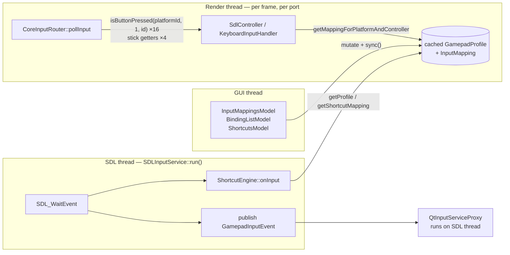
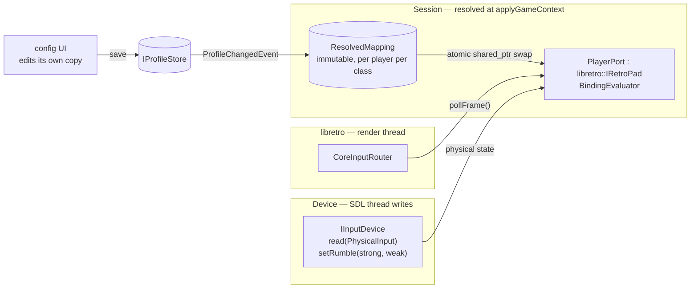

# Input: leakage, bugs, and a restructure plan

What the input system exposes that it shouldn't, what is broken because of it, and a sequenced way to
fix both. Companion to `module-boundaries.md`, which covers the cross-module picture; this goes deep on
input only.

**Method.** Read from source on `claude/platform-module-leakage-a7osls`. Every claim cites
`file:line`. Nothing was reproduced at runtime: the dev environment is Windows/MSYS2 and this pass was
static. Bugs are marked **live** when I traced a path a user can reach, and **latent** when the code is
wrong but I did not find a common path to it.

---

## Summary

The input lib's problem is less about which headers are public and more about **layering**. Four
different jobs are fused together:

| job | vocabulary it should speak | where it lives today |
|---|---|---|
| **device** — what the hardware is doing | physical buttons, axes, keys | `SdlController`, `KeyboardInputHandler` |
| **binding evaluation** — physical → virtual via a profile | bindings, turbo, toggle, analog tuning | *inside each device, re-implemented* |
| **session** — which device is which player, which mapping applies | player slots, game context | `SDLInputService` |
| **port** — what the libretro core polls | `RETRO_DEVICE_*` ids | `IRetroPad`, which every device inherits |

`IGamepad : libretro::IRetroPad` (`igamepad.hpp:12`) is the knot. Because a physical device *is* a
libretro port, the port's question — "is NES A pressed?" — has to be answered by the device, so every
device needs the profile, the mapping, the platform, and the controller layout. The rest of the
findings come from that one decision:

- `(platformId, controllerTypeId)` is threaded through every per-frame call so devices can look up a
  mapping. Callers pass `1` (`core_input_router.cpp:32,33,50`) or a device-class value
  (`:98`); the id is `GamepadInputClass` in disguise.
- Binding evaluation is written twice, once per device, and the two copies disagree. The keyboard
  ignores turbo and toggle; sticks ignore alternate bindings; `Binding::invert` and `Binding::scale` are
  persisted and read by nothing.
- The config UI and the running game share one mutable `GamepadProfile`/`InputMapping` object with no
  lock, so edits race the SDL and render threads.
- One untyped `int` means "gamepad button" or "`Qt::Key`" depending on a flag stored somewhere else, so
  QML has to know which: `isKeyboard` appears 17 times across 5 QML files.

Along the way: **10 bugs** — 8 live, including a use-after-free and three data races, and 2 latent —
plus **5 behaviour gaps**, **14 leaks** and **7 dead items**. §6 sketches the target design, including
what must happen when a mapping changes while a game is running, and §7 sequences the work: the bugs
first as small local changes, then five restructuring steps. **No step needs a schema change or a
migration pass**; one read-time normalization is covered in §7.

---

## 1. How input flows today

Three threads touch every device:



The same cached objects (`sqlite_controller_repository.cpp:336-339`, `:644-651`) are read by the SDL
and render threads and written by the GUI thread. None of them has a lock.

---

## 2. Bugs — fix regardless of the redesign

### B1 — keyboard stick null checks fall through to a dereference **[latent]**

`keyboard_input_handler.cpp:91-110` (X) and `:152-171` (Y):

```cpp
if (!m_profile) {
  if (m_keyStates[Qt::Key_Left]) { return -32767; }
  if (m_keyStates[Qt::Key_Right]) { return 32767; }
}                                          // no arrow held: falls through
auto mapping = m_profile->getMappingForPlatformAndController(...);   // null m_profile
if (!mapping) { /* same shape */ }
const auto mappedLeft = mapping->getMappedInput(...);               // null mapping
```

Crashes whenever the keyboard's profile is missing, or has no mapping for the platform being polled,
and no arrow key is held. I did not find a common path that produces a null mapping today, so this is
latent — but the guard is plainly broken.

### B2 — the Y-axis fallback reads Left/Right **[latent]**

Same lines. `getLeftStickYPosition`'s two null branches (`:153-159`, `:162-168`) test `Qt::Key_Left` and
`Qt::Key_Right`, copied from X. The final fallback at the end of the function correctly uses
`Key_Up`/`Key_Down`, which shows the intent. Same trigger as B1.

### B3 — `GamepadStatusItem` keeps a raw pointer to a device that can be unplugged **[live]**

`gamepad_status_item.cpp:20`: `m_controller = getInputService()->getPlayerGamepad(playerNumber).get();`
— the `shared_ptr` is dropped on the spot. Nothing clears `m_controller` on disconnect, and
`m_isConnected` is never updated after `setPlayerNumber`.

Reachable path: open a player's `ControllerProfilePage`, unplug that controller, click a platform. The
`onToggled` handler reads `gamepadStatus.profileId` (`ControllerProfilePage.qml:129`) →
`getProfileId()` (`gamepad_status_item.cpp:75-81`) → `m_controller->getProfile()` on a destroyed
`SdlController`. The interface's own contract says to hold the `shared_ptr`
(`retropad_provider.hpp:12-14`).

### B4 — `QtInputServiceProxy` mutates GUI state on the SDL thread **[live]**

`EventDispatcher` runs callbacks on the publishing thread (`event_dispatcher.hpp:40-43`), and
`GamepadInputEvent` is published from `SDLInputService::run()`'s `SDL_WaitEvent` loop
(`sdl_input_service.cpp:416,452,474`). The proxy's subscriber (`qt_input_service_proxy.cpp:192-222`)
therefore runs on the SDL thread and:

- inserts and erases `m_autoRepeatStates` (`:292`, `:302`) while `processAutoRepeat()` range-iterates the
  same `std::map` on the GUI thread every 16 ms (`:189`, `:308`) — a data race on a red-black tree, on
  every button press in the menus
- rewrites `m_currentGamepadButtonIcons` and emits `currentGamepadTypeChanged` (`:195-197`, `:273-283`)
  while QML reads the property
- calls `QApplication::focusWindow()` (`:206`) off the GUI thread

No lock anywhere in the file. `ControllerListModel` already does this correctly — it hops to the GUI
thread first, with a comment saying why (`controller_list_model.cpp:11-15`). Copy that.

### B5 — shortcut bindings are shared mutable state across threads **[live]**

`ShortcutEngine::onInput` (SDL thread, on every button event, game or no game) range-iterates
`profile->getShortcutMapping()->getAll()` (`shortcut_engine.cpp:98-111`). `ShortcutsModel::addBinding`
(GUI thread) calls `m_bindings[id].push_back(source)` on the same object
(`shortcuts_model.cpp:159`, `shortcut_mapping.cpp:24`). The object is the same because the repository
hands out its cached instance to both.

The assign flow makes the window real rather than theoretical: the user presses a button to assign it,
so the SDL thread is processing that press and its release while the GUI thread writes the binding.

The same pattern exists for game bindings — `InputMapping::getBindings()` returns a *reference* into
its map (`input_mapping.cpp:11-15`), which the render thread iterates while the binding editor
reassigns it (`input_mapping.cpp:46-50`) — and again for analog tuning, where `setProfileAnalogSettings`
overwrites the cached profile's `AnalogSettings` (`sqlite_controller_repository.cpp:495-497`) while the
render thread reads it on every stick read (`sdl_controller.cpp:110,149,169,189,209`).

**Which of these a player can reach mid-game.** In the live shell (`qml/v3/Main4.qml`) the running game
sits beneath the route view (`Main4.qml:283-289`), the navigation drawer opens on F9, an
application-wide shortcut (`:75-79`), and its Settings entry leads to a `SettingsScreen` that embeds the shortcut editor
(`qml/v3/old/settings/SettingsScreen.qml:240`, `ControllerSettings.qml:56,68,351`). By reading, nothing
pauses the game meanwhile (§6, *Changing a mapping while a game runs*). So the shortcut race is
reachable during play. The binding editor, analog tuning and profile management hang off the
`/controllers` routes, which are commented out of the live `RouteView` (`RouteView.qml:62-64`), so the
render-thread races are unreachable in this build. `routing.js` and `verify-ui` still list those
routes, so they look set to return — and the races with them.

### B6 — a device's profile is swapped on the render thread while the SDL thread reads it **[live, narrow]**

`SdlController::m_profile` is a plain `shared_ptr` member with no lock (`sdl_controller.cpp:12-19`).
`applyGameContext`/`clearGameContext` → `reapplyDeviceProfiles` → `setProfile` writes it from the
render thread (`sdl_input_service.cpp:154`); `ShortcutEngine::onInput` copies it on the SDL thread
without holding `m_devicesMutex` (`shortcut_engine.cpp:98`, called at `sdl_input_service.cpp:414,450`).
The window is a button event during game load or unload.

### B7 — rumble motors overwrite each other **[live]**

libretro calls `set_rumble_state` once per effect (`core_environment.cpp:262-273`), and each
`SdlController` call sets *both* motors because that is what `SDL_JoystickRumble` takes
(`sdl_controller.cpp:239-245`):

```cpp
setStrongRumble → SDL_JoystickRumble(j, 0, strength, 2000);   // zeroes the other motor
setWeakRumble   → SDL_JoystickRumble(j, strength, 0, 2000);   // and vice versa
```

A core that drives both motors only ever gets the one it set last. Separately, "strong" is sent to SDL's
*high*-frequency motor; SDL documents the low-frequency motor as the heavy one, so the pairing looks
swapped — worth confirming on hardware. The `platformId` parameter is ignored by both implementations.

### B8 — "Only player one can navigate menus" does nothing **[live]**

`QtInputServiceProxy::setOnlyPlayerOneCanNavigateMenus` stores the value in `QSettings`
(`qt_input_service_proxy.cpp:240-248`) and the settings page binds a toggle to it
(`qml/v3/old/settings/ControllerSettings.qml:91-92`). Nothing reads it: the subscriber forwards every
player's input to the focus window. A separate `only-player-one-hotkeys` setting in `SettingsService`
*is* enforced (`main.cpp:685`).

### B9 — the DualSense icon is a placeholder **[live]**

`controller_icons.hpp:23-25` returns `"file:whatever.svg"` for `SONY_DUALSENSE`, with the real path
commented out above it.

### B10 — a Hold shortcut unbound while it is held never ends **[live, unusual]**

`ShortcutMapping::setBindings` erases an action when it is given no sources
(`shortcut_mapping.cpp:16-18`). Two live edits do that: *Apply preset* rewrites every action and erases
the ones the new preset leaves out (`shortcuts_model.cpp:199-201`, `ControllerSettings.qml:68`), and
*Reset to default* erases an action its preset ships nothing for (`shortcuts_model.cpp:178`,
`ControllerSettings.qml:351`). The engine only produces a Hold's `Ended` while walking the actions still
in the mapping, and only when that device sends its next input (`shortcut_engine.cpp:111-178`). So a hold
that is active at that moment — fast-forward held on the keyboard while applying a preset with the
mouse — stays on until the action is bound again. *Clear* does the same, but its only live caller is on
the commented-out `/controllers` route (`ControllerProfilePage.qml:242`). Rebinding instead of erasing
does end the hold, but only at that device's next input.

---

## 3. Behaviour gaps — the binding model promises more than the devices deliver

These follow directly from binding evaluation living in each device.

| # | gap | where |
|---|---|---|
| G1 | The keyboard ignores `toggle` and `turbo`. The UI hides the menu for keyboard profiles to compensate (`ControllerInputMappingView.qml:283`) | `keyboard_input_handler.cpp:51-86` |
| G2 | Stick directions read only the first binding; alternates are ignored on both devices | `sdl_controller.cpp:158-159,178-179,198-199,218-219`; keyboard uses `getMappedInput` |
| G3 | `Binding::invert` and `Binding::scale` are serialized and read by nothing, anywhere | `binding.hpp:32-33` |
| G4 | Shortcut suppression covers every SDL read but only *default* keyboard keys; a key explicitly bound to a game input still reaches the game while a shortcut holds it | `sdl_controller.cpp:310` vs `keyboard_input_handler.cpp:57-73` |
| G5 | Toggle latches are keyed by a binding's *position* and cleared only when the device changes profile, so removing an earlier binding moves a latched "on" to whichever binding shifts into its slot | `sdl_controller.cpp:17-18,52` |

---

## 4. Leaks

### Vocabulary

**I1 — `controllerTypeId` is `GamepadInputClass` passed as a bare int.** It appears on every
`IRetroPad` method (`retropad.hpp:47-68`), in `GamepadProfile`, `InputMapping`, the binding-editor models,
the DB column `mappings.controller_type`, and the profile JSON. At runtime it has three values:

- `1` for every joypad read (`core_input_router.cpp:32,33,50`; `guest_stream_receiver.cpp:108`)
- `GamepadInputClass::Mouse`/`Lightgun` for mouse and light-gun reads (`core_input_router.cpp:95-98`)

`RemoteRetroPad` ignores it entirely (`remote_retropad.hpp:30,58-68`). The platforms header says as much
(`controller_type.hpp:13`: "`id` mirrors `deviceClass`"). Three modules share the convention and no type
enforces it.

**I2 — two enums for one vocabulary.** `libretro::IRetroPad::Input` (`retropad.hpp:10-36`) and
`input::GamepadInput` (`gamepad_input.hpp:14-41`) have identical values for every joypad input and no
`static_assert` tying them. 27 lines in non-test code cast into one or the other.

**I3 — `GamepadInput` is both the target and the source.** It is the *virtual* input a mapping is keyed
by (NES "A" is stored as `EastFace`) and the *physical* button a pad binding reads from
(`input_source.hpp:29`). `defaultPhysicalBinding()` (`gamepad_input.hpp:91`) is an identity function
for most inputs because the two spaces share one type, and `InputMappingsModel` computes `isDefault` by
comparing a virtual input to a physical one (`input_mappings_model.cpp:115`).

**I4 — one `int` means a button or a `Qt::Key`, depending on a flag stored elsewhere.**
`InputSource::code` (`input_source.hpp:29`), `InputMapping::addMapping`/`getMappedInput`
(`input_mapping.hpp:61-63`), `ShortcutsModel::addBinding` (`shortcuts_model.hpp:30`),
`BindingListModel::addBinding` (`binding_list_model.hpp:43`). Consequences:

- `isKeyboard` appears 17 times across 5 QML files, because the UI must know how to read a code
- `BindingListModel` always writes `SourceType::Button` and labels every code through
  `displayName(GamepadInput)` (`binding_list_model.cpp:24,124`), so a keyboard source would label as
  "Unknown" — which is why the QML hides it
- **persisted data is inconsistent**: `InputMapping::addMapping` writes `"type": "button"` for keyboard
  game bindings (`input_mapping.cpp:46-50`), while `ShortcutsModel::addBinding` writes `"type": "key"`
  for keyboard shortcuts (`shortcuts_model.cpp:154`). `SourceType` cannot be trusted for keyboard
  profiles today; only the profile's `kind` column can

**I5 — `GamepadType` and `DeviceType` are global, implicitly numbered, and persisted.**
`gamepad_type.hpp` declares both at global scope. `GamepadType`'s values come from declaration order,
and they are stored in `platform_preferences.gamepad_type` and `profiles.based_on_type`. Inserting a new
controller anywhere but the end silently changes which controller every stored preference means.
"Keyboard" is also represented four ways: `GamepadType::KEYBOARD`, `DeviceType::Keyboard`,
`GamepadProfile::isKeyboardProfile()`, and `profiles.kind`.

### Layering

**I6 — the device is a libretro port.** `IGamepad : libretro::IRetroPad` (`igamepad.hpp:12`), and
`igamepad.hpp` includes `gamepad_profile.hpp` and `input_mapping.hpp`. A physical device therefore
carries the profile model, resolves mappings per read (`sdl_controller.cpp:76`, `:122`, and every stick
getter), and holds suppression state as concrete members on an interface (`igamepad.hpp:18-24`).

**I7 — the mapping is resolved on every read instead of once per game.** `applyGameContext` already
receives the platform (`input_service.hpp:72`), yet the router separately stores it
(`core_input_router.hpp:25`) and passes it back into the device ~20 times per port per frame, where each
call does a linear scan for the mapping (`gamepad_profile.cpp:33-40`) and, for sticks, a second one for
analog settings. Not a measurable cost at this scale — but it is the reason the platform id has to reach
the device at all.

**I8 — `InputService` is six services in one interface.** Device registry, libretro retropad
provider, pointer provider, mouse feed, game context, and shortcut scope/hotkeys
(`input_service.hpp:39-91`). It is also an interface named without the `I` prefix.

**I9 — `IControllerRepository` is three stores in one interface.** Which profile a device uses; the
profiles themselves, with their analog settings, presets and import/export; and which profile or
controller a platform or game prefers (`controller_repository.hpp`).

**I10 — libretro speaks input's vocabulary.** `CoreInputRouter` includes `firelight/input/gamepad_input.hpp`
and `input_frame.hpp` (`core_input_router.hpp:7-8`), hand-maps every `RETRO_DEVICE_ID_LIGHTGUN_*` to the
matching `fi::Lightgun*` (`core_input_router.cpp:134-156`) even though those enumerators are *defined*
as `LIGHTGUN_INPUT_MASK | RETRO_DEVICE_ID_LIGHTGUN_*` (`gamepad_input.hpp:55-65`), and stores port
classes as `GamepadInputClass` ints. `InputFrame` (`input_frame.hpp`) is a libretro joypad record — a
bitmask "indexed by the RETRO_DEVICE_ID_JOYPAD_* id" — living in input.

### Persistence

**I11 — persistence lives inside domain objects, three different ways.**

| how you mutate a profile | persists? |
|---|---|
| `GamepadProfile::setName`, `setIcon`, `setDefaultAnalogSettings`, … (`gamepad_profile.cpp`) | no — memory only |
| `InputMapping`/`ShortcutMapping` mutators | only if the caller remembers `sync()` |
| `IControllerRepository::renameProfile`, `setProfileAnalogSettings`, … | yes, and updates the cache |

`GamepadProfile::setName` and `IControllerRepository::renameProfile` both exist; only one of them saves.
And because the repository hands the *same* cached objects to devices and to the UI, live edits apply by
aliasing — which is the mechanism behind B5.

### GUI concerns inside the lib

**I12 — a Qt GUI event type is in the lib's public API.** `GamepadKeyEvent : QKeyEvent`
(`gamepad_key_event.hpp`) exists so the keyboard device can ignore the key events menu navigation
synthesizes. It needs Qt GUI, which `firelight_input` links `PRIVATE` (`input/CMakeLists.txt:31`) — a
public header that depends on a private dependency. The keyboard device itself is a `QObject` event
filter installed on the window (`main.cpp:951-954`). All of the lib's Qt usage is keyboard-related:
the event filter, `QKeySequence` labels, `QKeyEvent`, and `QMetaEnum` for key names.

**I13 — menu navigation lives in the service proxy.** Gamepad→`Qt::Key` translation, auto-repeat, and
two icon tables sit in `QtInputServiceProxy` (`qt_input_service_proxy.cpp`), and run on the SDL thread
(B4). Two of its preferences persist to `QSettings` (`:182-184`) rather than `SettingsService`, where
`only-player-one-hotkeys` lives.

**I14 — input labels come from five places.** `displayName(GamepadInput)` in the root shared header
(`gamepad_input.hpp:143`), `GamepadStatusItem::getInputLabels` (different strings: "L1", "R1"),
`platforms::PlatformInputDescriptor::name`, `KeyboardInputHandler::getKeyLabel`, and the proxy's icon
tables. `modifierCandidates()` — "the inputs a shortcut editor offers" — is also a UI concern in the
root shared header (`gamepad_input.hpp:126`).

Two smaller ones:

- The app reaches into three private headers: `keyboard_input_handler.hpp` from two GUI models, only for
  its static `getKeyLabel`/`getDefaultKey`; `sdl_input_service.hpp` and
  `sqlite_controller_repository.hpp` from `main.cpp` (see `module-boundaries.md` L1/L2)
- `keyboard_keycodes.hpp:7-8` mirrors `RETROK_*` "rather than pulling the libretro headers into this
  library" — but `igamepad.hpp` → `retropad.hpp:3` already includes `libretro.h`

---

## 5. Dead code

| # | what | evidence |
|---|---|---|
| D1 | `src/app/input/platform_input_descriptor.hpp` — a second `PlatformInputDescriptor`, colliding in name with the platforms one | zero includes |
| D2 | `libretro::IKeyboardInputProvider` — an empty class | zero users |
| D3 | `GamepadProfileItem::getInputMappings` — also hands QML a parentless `new` model, the exact hazard the comment on `m_shortcutsModel` in the same class warns about | zero QML callers |
| D4 | `GamepadStatusItem::getInputLabels` and `isButtonPressed` | zero QML callers |
| D5 | `InputMappingsModel::m_inputService` and its two includes | assigned at `input_mappings_model.cpp:14`, never read |
| D6 | `ControllerIcons::controllerIcons` | declared, never defined or used |
| D7 | `docs/input-module.md` describes `shortcuts.hpp`, `input_sequence.hpp`, `InputSequence`, `ShortcutToggledEvent` and `*_v3` tables | none exist in the code |

---

## 6. Target design

The core move: **a device reports physical state and nothing else; one evaluator turns that into what a
console sees; the mapping is resolved once per game and swapped atomically; the libretro port speaks
only libretro.**



### Invariants the design enforces

1. **A device knows nothing about consoles.** No profile, no mapping, no platform, no libretro.
2. **Bindings are evaluated in exactly one place.** Every option on `Binding` works on every device, or
   is deleted.
3. **Nothing mutable is shared across threads.** The running game reads an immutable snapshot; the UI
   edits a copy and saves it; saving publishes an event; the session re-resolves and swaps.
4. **A value carries its own vocabulary.** No `int` whose meaning depends on a flag stored elsewhere.
5. **Dependencies point one way:** app → input → libretro. libretro includes nothing from input.

### Changing a mapping while a game runs

Invariant 3 makes a mid-game edit *safe*. It does not say what the player should *see*, and today that
is decided by accident.

**What happens today, by reading.** Nothing in the live shell pauses emulation when another screen
covers the game. `NewEmulatorPage.paused` is set only by the CLI `--pause` flag
(`NewEmulatorPage.qml:51,151`); `GameplayPage.suspended` is written and never read
(`GameplayPage.qml:9,29`); the live quick menu, `QuickMenu2`, has no pause either; and frames are paced
by their own thread (`emulator_item.cpp:288`). Input isn't gated on focus, so a pad used to navigate
Settings is also playing the game, and in-game shortcuts stay armed because `shortcutsInGame` only looks
at `paused` (`NewEmulatorPage.qml:41`). That is a shell decision rather than an input bug, but it is what
makes a mid-game edit possible at all. I have not run the app; this is the first thing to confirm.

**What a swap has to specify.** Step 3 carries today's accidents over unless the swap is defined:

1. **One snapshot per frame.** `pollFrame()` loads the mapping once, and the mouse and light-gun reads
   that arrive during `retro_run` use that same snapshot, so one frame never mixes two mappings.
2. **Held inputs follow the new mapping from the next frame.** A button held across a swap can produce
   a release, or a press on another input, that the player didn't make. Applying immediately is the
   simplest rule and matches "saving is live"; deferring each input until it is released is the
   alternative. Pick one and write it down.
3. **Latches follow the binding, not its position.** Key toggle state by the binding itself — target and
   source — and on each swap drop latches whose binding no longer exists (G5).
4. **A shortcut swap ends orphaned holds at swap time.** Any active hold whose action is gone, or whose
   trigger changed, ends when the swap happens rather than at that device's next input (B10).
5. **Analog tuning rides in the same snapshot.** A slider drag becomes many saves: debounce the
   database write, not the swap — swapping a small immutable struct per tick is cheap.
6. **Assignment changes get their own event.** `ProfileChangedEvent` covers a profile's *contents*.
   *Which* profile a device, platform or game uses is applied only in `applyGameContext`
   (`sdl_input_service.cpp:190`) and on connect, and today no UI calls `setGameProfileOverride` or
   `updateDeviceInfo`. When one does, it should publish an assignment event that re-resolves just the
   affected ports.

Switching a port's device class mid-game (Joypad to Zapper) needs no new mechanism: each `PlayerPort`
holds all three classes' mappings, so the switch is a lookup, and the old class's latches are dropped.
That picker is commented out of the live quick menu (`QuickMenu2.qml:67`).

### Key types

Sketches in this codebase's style, not final signatures.

```cpp
namespace firelight::input {

/**
 * What an emulated console reads. Today's GamepadInput, with the same values
 */
enum class VirtualInput : int { SouthFace = 0, /* … */ LightgunReload = 1040 };

/**
 * A physical pad control, numbered like VirtualInput so a pad's default binding stays the identity
 */
enum class PadInput : int { SouthFace = 0, /* … */ };

/**
 * A keyboard key, as a Qt::Key value
 */
struct KeyCode {
  int key = 0;
};

/**
 * Which of a console's input layouts a mapping is for. Replaces `controllerTypeId`
 */
enum class DeviceClass : int { Joypad = 1, Mouse = 2, Lightgun = 3 };

/**
 * A physical control a device reports: a pad button or axis half, or a keyboard key
 */
using PhysicalInput = std::variant<PadInput, KeyCode>;

/**
 * What one device is doing right now. Implemented by the SDL pad and the keyboard
 */
class IInputDevice {
public:
  virtual ~IInputDevice() = default;
  [[nodiscard]] virtual int16_t read(const PhysicalInput &input) const = 0;
  virtual void setRumble(uint16_t strong, uint16_t weak) = 0;
  [[nodiscard]] virtual DeviceIdentifier getIdentifier() const = 0;
  [[nodiscard]] virtual GamepadType getModel() const = 0;
};

/**
 * One profile's bindings for one platform and device class, defaults already applied. Immutable
 */
struct ResolvedMapping {
  std::map<VirtualInput, std::vector<Binding>> bindings;
  AnalogSettings analog;
};

/**
 * Turns physical state into what a console reads, honouring every Binding option. Owns the
 * toggle and turbo latches
 */
class BindingEvaluator {
public:
  libretro::InputFrame evaluateFrame(const IInputDevice &device, const ResolvedMapping &mapping,
                                     const InputSuppressor &suppressed);
  bool evaluate(const IInputDevice &device, const ResolvedMapping &mapping, VirtualInput input);
};

/**
 * A player's device bound to the running game's mappings. What the core polls
 */
class PlayerPort final : public libretro::IRetroPad {
public:
  libretro::InputFrame pollFrame() override;
  bool isDeviceInputActive(unsigned retroDevice, unsigned retroId) override;

  /**
   * Swaps in the mappings for a new game or an edited profile. Safe from any thread
   */
  void setMappings(std::shared_ptr<const std::array<ResolvedMapping, 3>> mappings);

private:
  std::shared_ptr<IInputDevice> m_device;
  std::atomic<std::shared_ptr<const std::array<ResolvedMapping, 3>>> m_mappings;
  BindingEvaluator m_evaluator;
};

} // namespace firelight::input

namespace firelight::libretro {

/**
 * One controller port as the core sees it, in libretro's own terms
 */
class IRetroPad {
public:
  virtual ~IRetroPad() = default;
  virtual InputFrame pollFrame() = 0;
  virtual bool isDeviceInputActive(unsigned /*retroDevice*/, unsigned /*retroId*/) { return false; }
  virtual void setRumble(retro_rumble_effect effect, uint16_t strength) = 0;
};

} // namespace firelight::libretro
```

`isDeviceInputActive(RETRO_DEVICE_LIGHTGUN, RETRO_DEVICE_ID_LIGHTGUN_TRIGGER)` is translated on the
input side by the same mask encoding `GamepadInput` already uses, so the router's hand-written switch
(I10) disappears and libretro stops including input headers. `RemoteRetroPad` shrinks to returning its
frame.

### What moves where

| today | target |
|---|---|
| binding evaluation in `SdlController` and `KeyboardInputHandler` | `BindingEvaluator`, once |
| `IGamepad : IRetroPad` | `IInputDevice` (physical) + `PlayerPort` (port) |
| `(platformId, controllerTypeId)` on every `IRetroPad` call | resolved once in `applyGameContext` |
| `InputFrame`, `captureJoypadFrame` in input | `InputFrame` in libretro; `PlayerPort::pollFrame` |
| `sync()` callbacks on `InputMapping`/`ShortcutMapping` | plain values; `IProfileStore::saveMapping(...)` |
| `IControllerRepository` | `IProfileStore`, `IDeviceStore`, `IAssignmentStore` — one SQLite class can implement all three |
| `InputService` | `IDeviceRegistry` (slots, order, connect events), `IInputSession` (game context, hotkeys, ports), a separate `PointerState` |
| `KeyboardInputHandler` as a `QObject` event filter | a Qt-free keyboard device fed by an app-side event filter |
| `GamepadKeyEvent`, auto-repeat, icon tables in the lib and proxy | app-side `GamepadNavigation`, which hops to the GUI thread first |
| five label sources | one app-side `InputLabels` |
| `QSettings` input prefs | `SettingsService` catalog |

After the last row, `firelight_input` needs Qt Core only — for the `Qt::Key` vocabulary and key-name
parsing — and no Qt GUI.

---

## 7. Migration plan

Each step ships on its own and leaves the app working. Steps 0–2 are low-risk; step 3 is the big one.

### Constraint: no data migration

The DB schema and the profile JSON stay as they are throughout. That holds because every persisted
number keeps its value: `GamepadInput` already has explicit values equal to the libretro ids (step 1 adds
the `static_assert`s), `controller_type` keeps 1/2/3 as `DeviceClass`, and step 1 pins `GamepadType` to
its current implicit values (`KEYBOARD = 0` … `UNKNOWN = 10`).

One normalization is needed in step 5: keyboard game bindings were saved as `"type": "button"` (I4). The
deserializer should coerce `button` → `key` when the profile's `kind` is keyboard. Idempotent, no
schema change, and it can ship before anything depends on it.

### Step 0 — bugs and dead code *(small, local)*

- B1/B2: return 0 after the null branches, and test Up/Down in the Y branches
- B3: hold the `shared_ptr` (or a `weak_ptr`) in `GamepadStatusItem`; refresh `connected`/`name` on
  connect and disconnect events
- B4: hop to the GUI thread at the top of the proxy's subscriber, the way `ControllerListModel` does
- B5 stopgap for shortcuts (the live half): guard `ShortcutMapping` with a mutex and have `getAll()`
  return a copy. A copy per button event is trivially cheap. The real fix is step 3
- B10 stopgap: have the engine end any active hold whose action has left the mapping. Without a
  swap hook that happens at the device's next input rather than immediately; step 3 makes it immediate
- Decide whether covering the game pauses it (§6). If it does, the render-thread halves of B5 stay
  closed for as long as the pause lasts, even once the `/controllers` routes return
- B7: store both strengths on the device and issue one `SDL_JoystickRumble` call with both
- B8: implement the setting or remove the toggle
- B9: point DualSense at its real icon
- D1–D6: delete; D7: mark `input-module.md` as partly stale until step 3 rewrites it

### Step 1 — pin the vocabulary *(mechanical, no behaviour change)*

- `static_assert` every `GamepadInput` joypad value against its `RETRO_DEVICE_ID_JOYPAD_*`; make
  `IRetroPad::Input` an alias or delete it (I2)
- `GamepadType` → `enum class` in `firelight::input` with explicit values; move `DeviceType` into the
  namespace (I5)
- Replace `int controllerTypeId` with `DeviceClass` in signatures across input and platforms (I1) — this
  also settles `module-boundaries.md` L10 in favour of keying `ControllerType` by class
- Rename `InputService` → `IInputService`

### Step 2 — one binding evaluator *(behaviour change: gaps close)*

- Extract `BindingEvaluator` from `SdlController`. Devices expose `read(PhysicalInput)` only
- Decide `invert`/`scale` (G3): implement them in the evaluator or delete them from `Binding`. The JSON
  reader already tolerates their absence
- The keyboard gains turbo and toggle (G1); sticks honour alternates (G2); suppression is uniform (G4).
  Remove the QML gate at `ControllerInputMappingView.qml:283`
- The evaluator is pure, so it gets table-driven tests against a fake device with no SDL; the existing
  `TestGamepad` (`libs/firelight/input/tests/test_gamepad.hpp`) is the starting point

### Step 3 — resolve once per game; immutable snapshots *(the big one)*

- `applyGameContext` builds `ResolvedMapping`s for each player and each `DeviceClass`, and hands them to
  `PlayerPort`s through an atomic `shared_ptr` swap. `std::atomic<std::shared_ptr>` needs libstdc++ from
  GCC 12; libc++ (MSYS2's clang64) may not have it, in which case the `std::atomic_load`/`atomic_store`
  overloads, or a mutex held only long enough to copy the pointer once per frame, do the same job
- `IRetroPad` loses `(platformId, controllerTypeId)`; `pollFrame()` replaces the 20 per-frame calls;
  `InputFrame` moves to libretro; `CoreInputRouter` drops its input includes and its lightgun switch
- The config UI loads a copy, saves through the repository, and the repository publishes
  `ProfileChangedEvent`; the session re-resolves and swaps. `sync()` callbacks, mapping ids and the
  virtual methods on `InputMapping` go. B5 and B6 are fixed structurally, and the step-0 mutex comes out
- The swap follows the rules in §6, *Changing a mapping while a game runs*
- Touches: devices, `SDLInputService`, `CoreInputRouter`, `RemoteRetroPad`, `guest_stream_receiver`, and
  the editing models

### Step 4 — split the two god interfaces

- `IInputService` → `IDeviceRegistry`, `IInputSession`, `PointerState` (I8)
- `IControllerRepository` → `IProfileStore`, `IDeviceStore`, `IAssignmentStore` (I9)
- Factories in public headers (`makeSdlInputService`, `makeSqliteControllerRepository`) so `main.cpp`
  stops including private headers

### Step 5 — move the UI out of the lib

- The keyboard device becomes Qt-free; an app-side event filter feeds it and ignores synthesized events
- `GamepadKeyEvent`, auto-repeat and the icon tables move to an app-side `GamepadNavigation` (I12, I13)
- One app-side `InputLabels` replaces the five label sources (I14). With `getKeyLabel`/`getDefaultKey`
  gone from the keyboard device, nothing outside the lib includes a private input header, and
  `libs/firelight/input/src` comes off the app's include path (`module-boundaries.md` L1)
- `InputSource` carries its own kind (I4). Models expose `sourceKind` and `sourceLabel` roles, and the
  17 `isKeyboard` checks in QML go
- The two `QSettings` preferences move into the `SettingsService` catalog
- `firelight_input` drops Qt GUI

---

## 8. What is already right

Worth keeping through all of the above:

- **`InputSuppressor`** (`input_suppressor.hpp`) — lock-free, four slots, with the reasoning written
  down. It stays per device and is handed to the evaluator unchanged.
- **`ControllerListModel`** marshals SDL-thread events to the GUI thread correctly, with a comment. It is
  the template for B4.
- **`SDLInputService`'s device collections** use a `shared_mutex` with events published after the lock
  is released, and `forgetDevice` runs while the removed `shared_ptr` is still alive, so the shortcut
  engine's pointer-keyed maps are safe (`sdl_input_service.cpp:237-270`).
- **The shortcut preset model** — "a preset is a starting point, not a tier"
  (`shortcut_registry.hpp:15-18`) — is clean, and the engine never resolves through presets.
- **`EmulatorInstance`** reaches input only through `EmulationContext`, never the locator.
- **`GamepadInput` already has explicit values equal to the libretro ids**, which is what makes "no data
  migration" possible.
