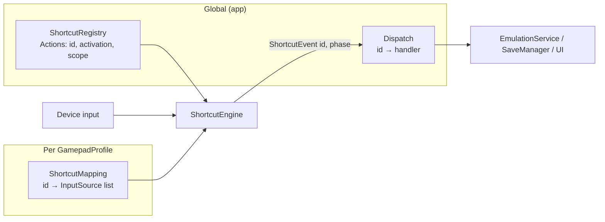

# Shortcut System

Shortcuts are the emulator hotkeys — fast-forward, rewind, save state, open menu,
screenshot, and so on. This document describes the design: how an action is
defined, how it's triggered, and how it's dispatched to whatever actually does
the work.

## The core split: global **Action**, per-profile **Trigger**, global **Dispatch**

Three decoupled pieces (mirrors the button-binding model, which is also
per-profile):

- **Action** — *global*. A catalog entry describing what a shortcut is, how it
  activates, and where it's allowed. There is exactly one `fast_forward`.
- **Trigger** — *per-profile*. Which buttons/keys fire it, bound on each
  `GamepadProfile` using the inputs that profile's controller actually has.
- **Dispatch** — *global*. A `ShortcutId → handler` registry in the app that
  runs the behavior.

The action is singular; every device triggers it its own way. Because triggers
live on the profile, each device evaluates **its own** profile's shortcuts —
there is no "which controller wins" ambiguity, and oddball controllers (an N64
pad with no L3/R3) bind against the buttons they have.



## Data model

```cpp
using ShortcutId = std::string;               // "fast_forward", "save_state" — stable, JSON-friendly

enum class ActivationType { Press, Hold, Toggle };
enum ShortcutScope { InGame = 1, InMenu = 2, Always = InGame | InMenu };

// GLOBAL, app-defined — catalog entry (metadata + behavior contract)
struct ShortcutAction {
  ShortcutId    id;
  std::string   displayName, category;
  ActivationType activation;
  int           scope;                        // ShortcutScope flags
  std::vector<InputSource> defaults;          // shipped default triggers
};

// PER-PROFILE user config — lives on GamepadProfile, next to button bindings
//   ShortcutMapping wraps: std::map<ShortcutId, std::vector<InputSource>>

// Emitted by the engine, consumed by dispatch
enum class ShortcutPhase { Started, Ended };
struct ShortcutEvent { int playerIndex; ShortcutId id; ShortcutPhase phase; bool toggledState; };
```

`InputSource` (`input_source.hpp`) is reused as the trigger — it already holds a
`code` (a `GamepadInput` for a pad, a `Qt::Key` for the keyboard) plus
`modifiers`, so it works identically across device types and replaces the old
`InputSequence`.

## Multiple bindings per shortcut — two axes

- **Within a profile** — a shortcut maps to a `vector<InputSource>`, so one
  device can have several trigger combos for the same action.
- **Across devices** — the keyboard is its own profile, so binding
  `fast_forward` on the keyboard profile *and* on a controller profile makes
  both fire the one action. Both devices are live simultaneously.

## Activation types (fixes hold)

Activation lives on the **action**, so the engine knows how to interpret an edge:

| Type | Behavior | Emits |
|---|---|---|
| `Press` | fires once on the rising edge | `Started` |
| `Hold` | active while the combo is held | `Started` on press, `Ended` on release |
| `Toggle` | press flips a latch | `Started` with the new `toggledState` |

`Hold` emitting a matching `Ended` is what makes "hold to fast-forward, release
to resume" work — the old system only fired on button-down.

## Scope — gameplay vs. menus

Each action declares a `scope`, and the engine holds a **current context** the
app updates:

- `InGame` — a game is running with no overlay (save state, rewind,
  frame-advance, reset, pause).
- `InMenu` — the library or an open overlay.
- `Always` — screenshot, mute, fullscreen, quit.

`EmulationService` sets `InGame` on load; opening the quick-menu overlay switches
to `InMenu`; the library is `InMenu`. The engine only fires an action when
`action.scope & currentContext`. Every device (keyboard included) always has a
profile, so menu-scope shortcuts still work per device.

## The detection engine

One `ShortcutEngine` (`libs/firelight/input/`) replaces both the old
`SdlController::getToggledShortcuts` path and the keyboard `eventFilter` path:

```cpp
class ShortcutEngine {
  void setContext(int scope);
  // Fed by the SDL loop (gamepad buttons) AND the keyboard (Qt keys):
  void onInput(int playerIndex, IGamepad* device, int code, bool pressed);
  //  -> tracks per-device held inputs, recomputes each shortcut's "satisfied"
  //     state (its InputSource code + all modifiers held), edge-detects,
  //     applies activation + scope, and publishes ShortcutEvent.
};
```

Detection reads the triggering device's own profile (`device->getProfile()
->getShortcutMapping()`), so pad and keyboard use one implementation.

## Dispatch + catalog

The app owns the global catalog (populated into `ShortcutRegistry` at startup)
and the `ShortcutId → handler` routing. `QtInputServiceProxy` re-emits
`ShortcutEvent` to QML as `shortcutTriggered(id, phase)` for menu/UI actions;
C++ services handle gameplay ones.

Starter catalog (ids · activation · scope):

| id | activation | scope |
|---|---|---|
| `fast_forward` | Hold | InGame |
| `toggle_fast_forward` | Toggle | InGame |
| `rewind` | Hold | InGame |
| `slow_motion` | Hold | InGame |
| `speed_up` / `slow_down` | Press | InGame |
| `save_state` / `load_state` | Press | InGame |
| `state_slot_next` / `state_slot_prev` | Press | InGame |
| `open_rewind_menu` / `open_quick_menu` | Press | InGame |
| `frame_advance` / `reset` / `pause` | Press | InGame |
| `screenshot` / `toggle_mute` / `toggle_fullscreen` | Press/Toggle | Always |
| `exit_game` | Press | InGame |

## Defaults & the built-in-profiles pairing

Because triggers are per-profile, the tedium of "rebind on every profile" is
removed by shipping shortcut defaults with each **built-in profile** (per
`GamepadType`) — the N64 built-in uses N64-available buttons, the Xbox one uses
`L3+R3`, etc. Most users never rebind. This is the main reason the built-in
profile seeding is worth doing alongside this.

## Conflict with game input

A gameplay shortcut bound to a bare button also reaches the running core. Two
mitigations, applied together:

- **Combo defaults** — gameplay shortcuts default to modifier + input.
- **Optional `suppressInGame`** on a binding — when the shortcut fires, swallow
  the input so the core doesn't also see it.

## What changes vs. today

| | Today | New |
|---|---|---|
| Catalog | 5-value `Shortcut` enum in the input lib | global `ShortcutRegistry`, string ids, extensible |
| Triggers | per-profile `ShortcutMapping` (`InputSequence`) | per-profile (kept) — `map<id, vector<InputSource>>` |
| Multi-binding | one sequence per shortcut | vector per profile + across device profiles |
| Activation | press-only (hold broken) | Press / Hold / Toggle |
| Scope | none | InGame / InMenu / Always |
| pad vs keyboard | two detection paths | one `ShortcutEngine` |
| dispatch | QML switch on enum int | `ShortcutId → handler` registry |
