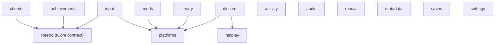

# `libs/firelight` — domain modules

Each subdirectory here is a self-contained static library (`firelight_<name>`) holding one
slice of Firelight's domain logic. They avoid Qt/SQLite where they can, expose their contract
through `include/firelight/<name>/`, ship their own `firelight_<name>_test` target, and are
linked into `firelight_lib`. Each module's own `README.md` has a class/relationship diagram
and the load-bearing facts for that module.

## How the modules depend on each other

---

Arrows point from a module to what it depends on. Modules with no arrows are independent leaves.

> **`db` is gone on this branch.** The former `firelight_db` module (userdata/content SQLite)
> is deleted in the working tree; its savefile/suspend-point metadata now lives in `saves`.
>
> **`libretro/` is a scaffold** — the operative `libretro::Core` dlopen wrapper currently
> lives in `src/app/libretro/`; `cheats`/`achievements`/`input` depend only on the `ICore`
> contract in `include/firelight/libretro/`.

## Modules

---

| Module | Layer | What it does |
|---|---|---|
| [`platforms`](platforms/README.md) | Foundation | Static library that hardcodes Firelight's catalog of emulated consoles ("platforms") and answers lookup… |
| [`libretro`](libretro/README.md) | Foundation | The libretro ABI wrapper: it dlopen's a libretro core DLL and drives its full lifecycle… |
| [`settings`](settings/README.md) | Foundation | Static lib that models Firelight's emulation settings: a declarative catalog of "friendly" settings and their… |
| [`activity`](activity/README.md) | Foundation | Static lib that records "play sessions" — when a user started/ended a game and how long it ran unpaused — and… |
| [`audio`](audio/README.md) | Foundation | Audio-DSP static library for the emulation pipeline |
| [`metadata`](metadata/README.md) | Foundation | Static lib that answers two related questions about a game identified by its content hash: (1) what do we… |
| [`media`](media/README.md) | Foundation | Static lib (firelight_media) that owns everything media-capture and live-streaming for the emulator: saving… |
| [`netplay`](netplay/README.md) | Foundation | Static lib implementing Firelight's peer-to-peer netplay: a persistent, host-authoritative lobby (membership,… |
| [`saves`](saves/README.md) | Foundation | Static library that persists emulator save data |
| [`cheats`](cheats/README.md) | Domain | Static lib for "typed" per-game cheats |
| [`mods`](mods/README.md) | Domain | A tiny read-only catalog of curated ROM-hack "mods" |
| [`library`](library/README.md) | Domain | Static lib (firelight_library) that owns the user's game library |
| [`achievements`](achievements/README.md) | Domain | Static lib (firelight_achievements) providing RetroAchievements support |
| [`input`](input/README.md) | Connected | Static lib that turns physical input devices (SDL gamepads + the keyboard) into libretro RetroPad/pointer… |
| [`discord`](discord/README.md) | Connected | Static lib that wraps the Discord Social SDK for two independent jobs: publishing Discord Rich Presence (what… |
