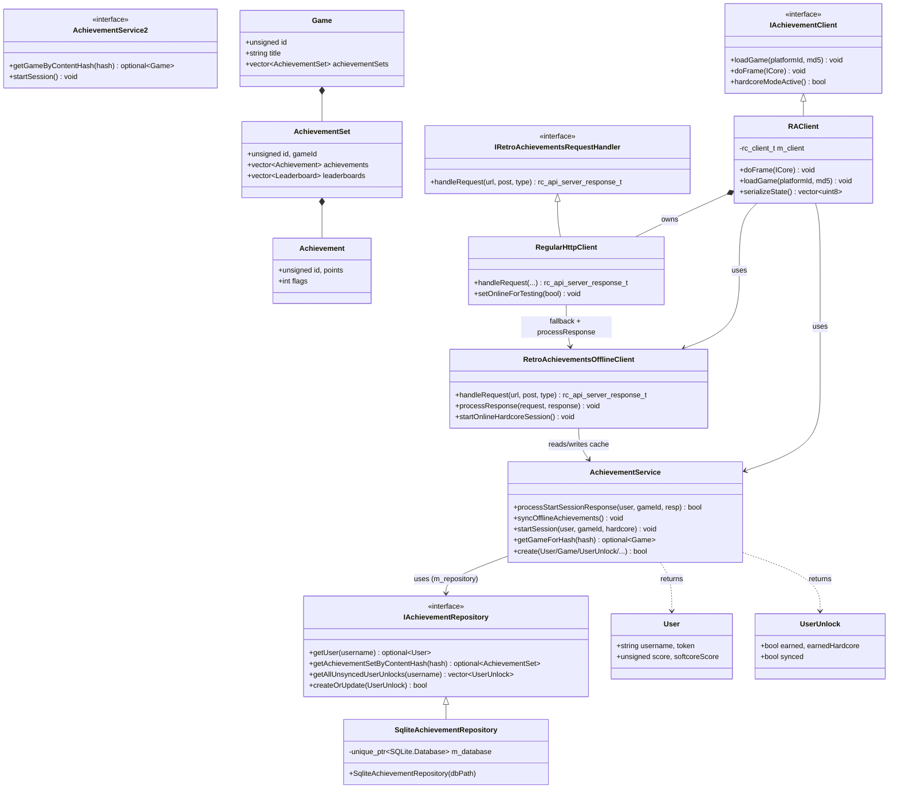

# Firelight Achievements Module
Pretty much everything here is not "normalized" to Firelight - as in, any IDs are RetroAchievements IDs, not Firelight
IDs. The interfaces are generic enough that it could work with a different achievements backend, but...
no other ones exist! (And likely won't)

## How it works

---

There are a few things going on here. First, there's the RAClient that is what's actually running the logic from the 
RetroAchievements DLL. That's pretty straightforward. If you disagree then update this doc ;)

The extra part on top is the offline processing. When the RAClient makes HTTP requests out to 
the RetroAchievements server, it works like normal while the user is online. Then, when the response is received, we 
"process" it. As in, we use it to update the state of the local cache. Then, when the user is offline, we don't expose
that to the RAClient - the HTTP client (wrapper) handles it by interpreting the request itself, processing it using the 
local cache, and returning the result. Then, when the user is back online (or the next time they start the app), we send
unlock requests to the RetroAchievements server until the states match. If something goes wrong we use the RA server as
the authority.

For example, if a user unlocks an achievement while offline, we will:
1. Look up the achievement in the database
2. Update the user's points to account for the newly unlocked achievement
3. Mark the achievement unlock as synced in the database

If the user is in hardcore mode, then we persist the unlocks during the gameplay session, but if the gameplay session
ends while there are achievements earned during it and we're not online yet, then those achievement unlocks get
demoted to non-hardcore. On trying to close a game the UI can display a warning/confirmation to the user.

## Architecture

---

Achievements module: AchievementService (README entrypoint) fronts persistence via IAchievementRepository/SqliteAchievementRepository, while the emulation loop drives the IAchievementClient slice (RAClient), which delegates to the service and an offline-capable HTTP handler pair (RegularHttpClient + RetroAchievementsOfflineClient). Game/AchievementSet/Achievement form the domain data model.

## Data Structures

---

### Achievement Service
The entrypoint into the module. This interface provides all the methods to get information about achievements, users,
and the rest of the stuff below.

### Achievement
It's an achievement! Stores the title, description, points, author, image URL, etc. Does NOT store information about
how to unlock it and is not inherently associated with a user.

### Achievement Progress
Represents the progress on one achievement for a user. This is cached during gameplay (on achievement progress events) 
so that progress can be displayed in the UI despite normally only being available at runtime.

### Achievement Set
Represents a collection of achievements. Has its own icon, title, etc., and belongs to a Game.

### Game
Represents a Game in RetroAchievements. It has its own metadata and a list of Achievement Sets that belong to it.

### Leaderboard
I'm not using these yet. :-)

### User
Represents a RetroAchievements user and their associated info like number of points, avatar URL, etc.

### User Unlock
Represents the unlock status for one achievement for one user. It stores whether the user has earned it (in hardcore or
not) and the timestamps. It also stores whether the unlock status is synced with the RetroAchievements server for 
offline use.