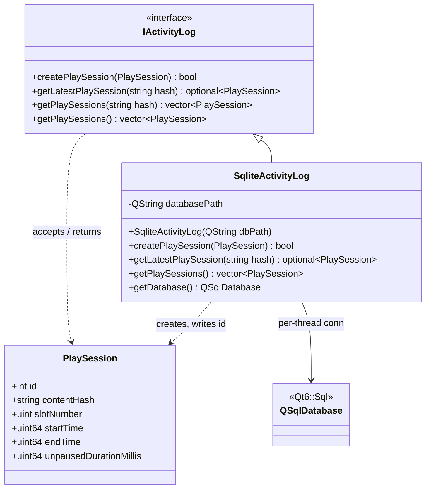

# Firelight Activity Module
This is pretty much just one data type (Play Session) and the interface used to persist them.

## Architecture

---

The activity module is a single interface (IActivityLog) with one SQLite-backed implementation that persists and retrieves PlaySession records over per-thread QSqlDatabase connections.

## Data Structures

---

### Activity Log
The entrypoint into the module. Lets you create and retrieve play sessions.

### Play Session
Represents the start and end time for a user's game session. Also keeps track of the number of seconds during which the 
game was NOT paused.