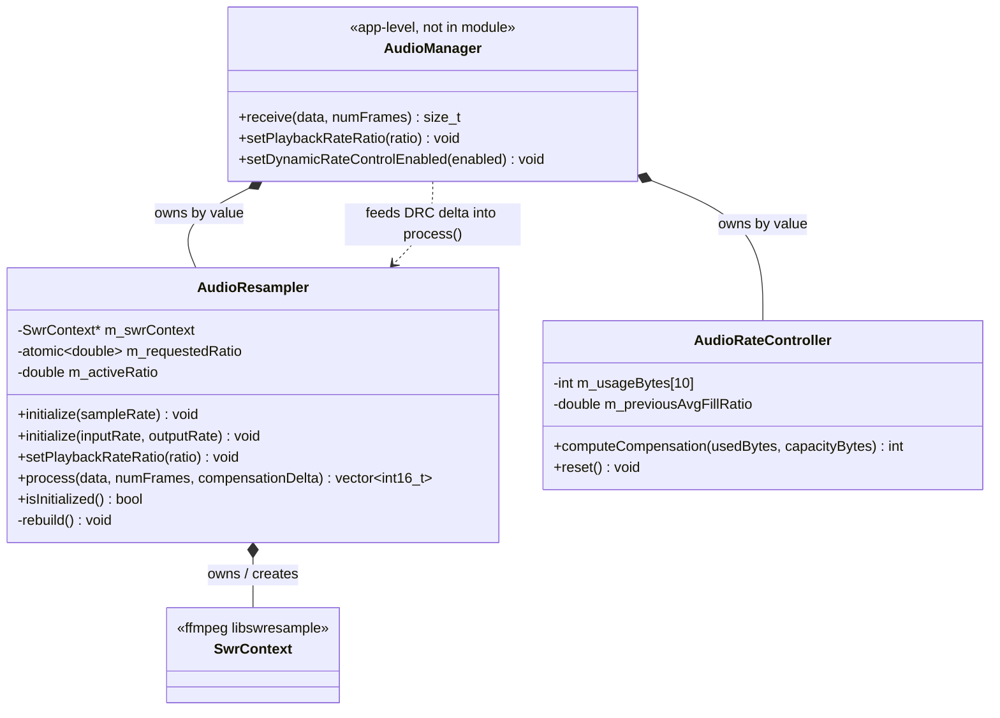

<!-- SCAFFOLD: the prose in this file was seeded from an automated read of the code so you can rewrite it in your own voice (see activity/ and achievements/ for the tone). The "How it works" bullets are the load-bearing facts that currently live only in comments — fold them into prose, then trim the inline comments. Delete this line when done. -->
# Firelight Audio Module
Self-contained audio-DSP static library for the emulation pipeline: it converts a libretro core's interleaved-stereo S16 audio to the output device's sample rate (via FFmpeg libswresample) and runs the Dynamic Rate Control (DRC) logic that keeps the audio sink buffer near 50% full to avoid underruns/overruns.

## How it works

---

**Entry point:** AudioResampler — the workhorse that transforms audio and is the type external callers hold first. Note this module has no single facade: it exposes two independent peer classes (AudioResampler + AudioRateController) that are wired together by the app-level AudioManager (src/app/audio), which lives outside this module.

<!-- Load-bearing facts (thread rules, invariants, protocol ordering, gotchas). Rewrite as prose. -->
- Audio format is fixed: interleaved STEREO (2 channels) S16 throughout. process() allocates its output vector as maxOut*2 (stereo) and resizes to outSamples*2; rebuild() hardcodes a default 2-channel layout for both in and out.
- THREADING (AudioResampler): m_requestedRatio is std::atomic<double> and may be WRITTEN from any thread via setPlaybackRateRatio(); m_activeRatio and the SwrContext are only ever MUTATED on the process()/initialize() thread. process() re-reads m_requestedRatio each call and lazily rebuild()s only when abs(requested-active) > 1e-6 and m_sampleRate > 0. (Verbatim source comment: 'Requested from any thread; the active value is only changed on the process()/initialize() thread.')
- Rate-ratio direction: rebuild() computes outputRate = lround(m_outputSampleRate / m_activeRatio). ratio > 1.0 => LOWER output rate => plays back FASTER; ratio < 1.0 => slower. setPlaybackRateRatio clamps ratio <= 0.0 up to 1.0.
- initialize(int sampleRate) is a PASSTHROUGH convenience (input==output). The two-arg initialize(input,output) resamples to the device's native rate specifically so the OS doesn't resample a second time (stated rationale in header).
- Compensation-delta SIGN CONVENTIONS live only in comments and are easy to get wrong on a rewrite: AudioResampler header says a POSITIVE compensationDelta REDUCES output sample count and NEGATIVE increases it. AudioRateController returns NEGATIVE when the buffer is too full ('drop samples': -5/-4/-3) and POSITIVE when too empty ('add samples': +1/+2). The two conventions are bridged by AudioManager (outside the module) — preserve both statements exactly.
- process() only calls swr_set_compensation when numFrames > 300 OR compensationDelta != 0 — a deliberate guard (avoid setting compensation on tiny buffers). This '300' threshold is a magic hot-path constant with no explanatory comment.
- On swr_init failure rebuild() logs via spdlog and swr_free()s the context, so isInitialized() goes back to false and process() safely returns {} until re-initialized. numFrames==0/maxOut<=0 also return an empty vector.
- AudioRateController tuning constants (only encoded in code): WINDOW_SIZE=10 rolling average; TARGET_FILL_RATIO=0.5; hysteresis WITHIN_TARGET_TOLERANCE=0.05 (~45-55% fill) and EXTREME_DEVIATION=0.25 (<25% or >75%). It skips adjusting (returns 0) when nearTarget OR (trendingWell && !extreme). Trend/previous-fill logic only engages once the window is fully populated (m_populatedCount == WINDOW_SIZE).
- AudioRateController deviation->delta ladder is ASYMMETRIC and has a dead zone: dev>0.6=>-5, >0.3=>-4, >0.1=>-3, >-0.3=>0 (dead zone -0.3..0.1), >-0.6=>+1, else +2. Dropping (buffer full) is more aggressive than adding.
- bufferCapacityBytes <= 0 makes computeCompensation return 0 immediately (divide-by-zero / uninitialized-sink safety; covered by ZeroCapacityIsSafe test).

## Architecture

---

The firelight_audio module exposes two independent peer classes — AudioResampler (wraps an ffmpeg SwrContext for DRC-compensated resampling) and AudioRateController (computes the compensation delta) — with no cross-reference; the app-level AudioManager owns both by value and wires them together.

## Data Structures

---

### AudioResampler _(class)_
Wraps an FFmpeg SwrContext to resample interleaved-stereo S16 audio from the core's input rate to the device's output rate. Applies two independent rate adjustments: a feed-forward playback-rate ratio (baseline, e.g. from sync-to-monitor) and a per-call compensation delta (drift correction from DRC). Non-copyable; owns and frees its SwrContext.

### AudioRateController _(class)_
Pure-C++ Dynamic Rate Control decision-maker (no external deps). Keeps a WINDOW_SIZE=10 rolling average of the sink buffer's byte occupancy and, from its deviation off a 50% fill target, returns a small integer compensation delta for AudioResampler to consume. Includes hysteresis so it stops nudging when near target or already trending back.
