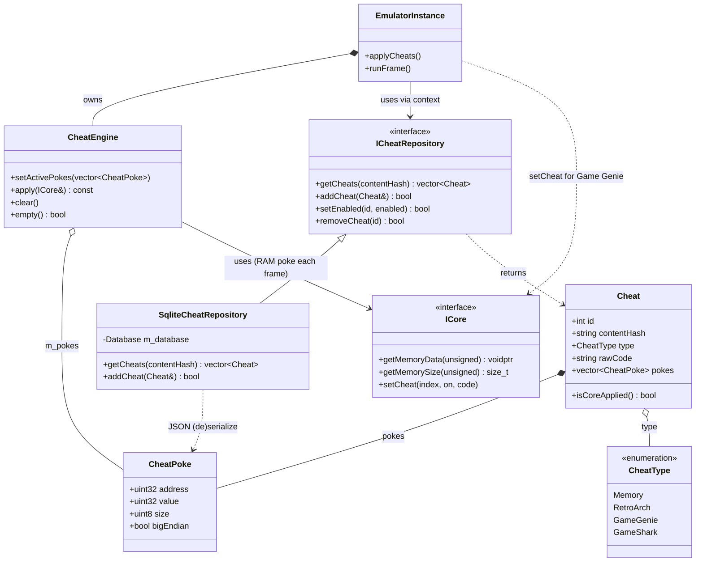

<!-- SCAFFOLD: the prose in this file was seeded from an automated read of the code so you can rewrite it in your own voice (see activity/ and achievements/ for the tone). The "How it works" bullets are the load-bearing facts that currently live only in comments — fold them into prose, then trim the inline comments. Delete this line when done. -->
# Firelight Cheats Module
A self-contained static lib for "typed" per-game cheats: it models cheats uniformly across formats, persists them per game, and applies the RAM-poke kinds into the running core every frame (while handing Game Genie codes to the core itself).

## How it works

---

**Entry point:** CheatEngine is the runtime entrypoint (holds the active pokes and applies them each frame); ICheatRepository / SqliteCheatRepository is the persistence entrypoint. The module has these two facades and no single orchestrating service — the app's EmulatorInstance ties them together.

<!-- Load-bearing facts (thread rules, invariants, protocol ordering, gotchas). Rewrite as prose. -->
- CheatEngine::apply must use the unsigned-id getMemoryData(SYSTEM_RAM) overload — it returns the LIVE writable RAM pointer (the same one rcheevos reads). The MemoryType overload would hand back a COPY of save data instead, so poking that would do nothing.
- RAM pokes are re-applied every emulated frame, right after m_core->run(0), because the game continuously overwrites those addresses. Continuous replay is the entire point; a one-shot write would be reverted by the next frame of gameplay.
- apply() is bounds-checked: any poke whose address+size exceeds the core's reported RAM size is skipped, and apply() is a no-op when there are no pokes or the core exposes no writable system RAM (null/zero size).
- Game Genie / emu-handler cheats are 'core-applied' (isCoreApplied(): pokes empty but rawCode set) and are ROM read-substitution only the core can do via ICore::setCheat / retro_cheat_set — they bypass CheatEngine entirely. Everything else resolves to Firelight-owned RAM pokes.
- affectsHardcore cheats are blocked while RetroAchievements hardcore mode is active; EmulatorInstance::applyCheats() skips them when hardcore is on. That flag exists specifically to gate gameplay-affecting cheats during hardcore.
- Cheats are keyed to a game by contentHash and ordered by ordinal. addCheat appends after the game's existing cheats by computing nextOrdinal = COALESCE(MAX(ordinal)+1, 0) for that hash, and writes the assigned id/ordinal back onto the passed-in Cheat&.
- CheatType integer values are a persisted storage contract: Memory=0, RetroArch=1, GameGenie=2, GameShark=3 are stored as the `type` INTEGER column, so the numbering must not be reordered.
- Pokes are stored as a JSON array in the pokes_json column with compact keys a/v/s/be (address/value/size/bigEndian). Deserialization uses nlohmann::json::parse with allow_exceptions=false and per-field .value() defaults, so a malformed/garbage row degrades to defaults rather than throwing.
- Per-poke bigEndian controls byte order: when true, bytes are emitted most-significant-first (the loop reverses byteIndex to size-1-i); otherwise little-endian.
- All repository methods catch every exception, log it via spdlog, and return false / an empty vector — the emulation layer never has to handle a thrown exception from cheat storage.
- The sqlite schema (cheats table plus idx_cheats_hash index on content_hash) is created lazily inside the SqliteCheatRepository constructor via CREATE ... IF NOT EXISTS; the DB is opened OPEN_READWRITE | OPEN_CREATE.
- setActivePokes replaces the ENTIRE active write set. EmulatorInstance::applyCheats() rebuilds it each time by clearing, then flattening every enabled, non-core, hardcore-allowed cheat's pokes into one vector and calling setActivePokes once.

## Architecture

---

Two facades — CheatEngine (replays RAM pokes each frame) and ICheatRepository/SqliteCheatRepository (per-game persistence); the app's EmulatorInstance owns the engine and holds the repository via EmulationContext, routing Game Genie codes straight to the core.

## Data Structures

---

### CheatType _(enum)_
How a cheat's code is interpreted — this picks the decoder and, indirectly, how it gets applied. Memory, GameShark/Action Replay and imported RetroArch entries resolve to Firelight-owned RAM writes; GameGenie is ROM read-substitution only the core can do. The integer values are persisted to the DB, so the numbering is a storage contract.

### CheatPoke _(struct)_
One resolved write into emulated RAM: `size` bytes (1/2/4) of `value` at `address`, with optional big-endian byte order. The atomic unit the CheatEngine replays each frame.

### Cheat _(struct)_
Firelight's uniform model of a cheat across every format: user-facing metadata plus a resolved application. `pokes` are the RAM writes replayed each frame; a cheat with no pokes but a `rawCode` is handed to the core (Game Genie). Keyed to a game by content hash, ordered by `ordinal`.

### CheatEngine _(class)_
Firelight's own equivalent of RetroArch's 'retro' cheat handler: it holds the active set of RAM pokes and writes them into the core's live system memory every emulated frame (bounds-checked), so values the game overwrites are continuously re-applied. Core-applied cheats (Game Genie) are NOT its job. This is the module's runtime workhorse.

### ICheatRepository _(interface)_
Per-game cheat storage abstraction, kept behind an interface so the emulation layer and tests depend on it rather than sqlite (mirrors the other repositories). CRUD over cheats keyed by content hash, always returned ordered by ordinal.

### SqliteCheatRepository _(class)_
The sqlite-backed ICheatRepository. Lazily creates the `cheats` table and content_hash index in its constructor, serializes each cheat's pokes to a compact JSON column, and swallows+logs exceptions (returning false/empty on failure) so callers never see a throw. The persistence entrypoint.
