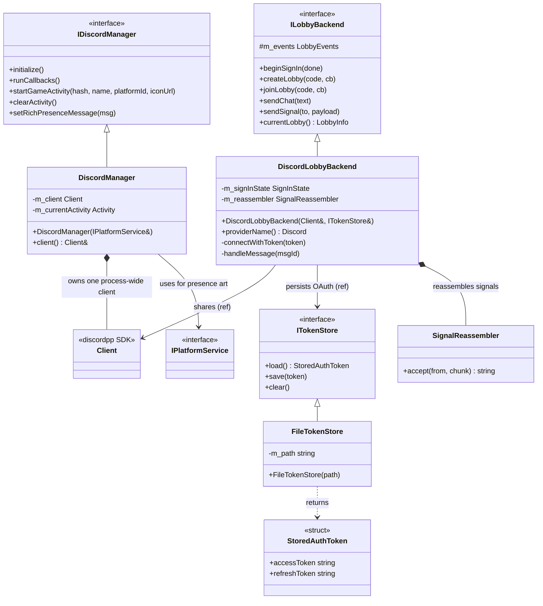

<!-- SCAFFOLD: the prose in this file was seeded from an automated read of the code so you can rewrite it in your own voice (see activity/ and achievements/ for the tone). The "How it works" bullets are the load-bearing facts that currently live only in comments — fold them into prose, then trim the inline comments. Delete this line when done. -->
# Firelight Discord Module
A self-contained static lib that wraps the Discord Social SDK for two independent jobs: publishing Discord Rich Presence (what game you're playing) and adapting Discord lobbies/chat/connection-signaling onto the app's netplay ILobbyBackend seam. It is the only code that touches Discord types or OAuth tokens; nothing outside the adapter sees them.

## How it works

---

**Entry point:** DiscordManager (implements firelight::discord::IDiscordManager). It is the process-wide facade the rest of the app reaches through ServiceAccessor::getDiscordManager(), constructed in main.cpp; it owns the single discordpp::Client and drives Rich Presence. The module has a second, netplay-facing facade, DiscordLobbyBackend, which borrows DiscordManager's client via client() rather than owning its own. That backend is currently NOT wired in main.cpp (a DirectLobbyBackend is used instead), with a comment that DiscordLobbyBackend can swap back in once the app's OAuth client is configured in the Discord developer portal.

<!-- Load-bearing facts (thread rules, invariants, protocol ordering, gotchas). Rewrite as prose. -->
- THREADING INVARIANT (from DiscordLobbyBackend header, verbatim in spirit): everything — UI calls AND SDK callbacks — runs on the thread that pumps RunCallbacks, i.e. the main thread. No locking exists because of this; violating it breaks the module.
- The single discordpp::Client is process-wide and owned by DiscordManager; DiscordLobbyBackend must borrow it via client() rather than construct its own ('The one process-wide SDK client; the lobby backend shares it.').
- Discord application id is hardcoded in TWO places that must stay in sync: DiscordManager::initialize() (SetApplicationId 1208162396921929739) and the APPLICATION_ID constant in discord_lobby_backend.cpp.
- joinLobby gotcha: the SDK's CreateOrJoinLobby silently creates a fresh, host-less lobby when the join code matches nothing. The adapter detects this by the ABSENCE of the 'host' metadata key, leaves the accidental lobby, and reports 'That code doesn't match an open lobby'. Without this the user would sit alone in a phantom lobby.
- Lobby compatibility is enforced via lobby metadata: METADATA_HOST_KEY='host' (host user id) and METADATA_PROTO_KEY='proto' (netplay::PROTOCOL_VERSION). A proto mismatch is rejected with 'The host is on a different Firelight version'.
- Connection-signaling (SDP) payloads exceed Discord's ~2000-char message cap, so they are chunked at SIGNAL_CHUNK_CHARS=1200 (deliberately under the cap to leave room for metadata) via netplay::chunkSignal and reassembled by SignalReassembler keyed on (sender, signalId).
- Signal messages are distinguished from chat by metadata tags {fl:'sig', to:<recipientId>, sid:<signalId>, i:<index>, n:<total>} and are filtered out of the chat path in handleMessage; they are only accepted when addressed to the local user's id.
- handleMessage ignores messages authored by the local user (authorId == localIdentity().id) and messages not belonging to the current lobby; malformed signal chunks are caught, logged as a warning, and swallowed.
- chatReceived is only fired for REMOTE senders (the session appends the local user's own messages itself); this is why handleMessage returns early on self-authored messages.
- Sign-in flow / state machine: beginSignIn tries a stored access token first (connectWithToken -> UpdateToken -> Connect); if UpdateToken is rejected it falls back to beginFullAuthorization (OAuth PKCE: CreateAuthorizationCodeVerifier, Authorize with challenge, GetToken exchange, save tokens). A Disconnected status during SigningIn with m_triedRefresh==false means the stored access token likely expired, so it attempts exactly one refresh via refreshWithStoredToken (m_triedRefresh guards against loops).
- Status/expiration callbacks: StatusChanged==Ready -> finishSignIn(true); Disconnected while Ready -> state drops to SignedOut; SetTokenExpirationCallback -> refreshWithStoredToken. A failed refresh clears the token store.
- localIdentity() and currentLobby()'s self return empty unless signInState()==Ready; currentLobby() returns an un-joined LobbyInfo (self only) when m_lobbyId==0.
- FileTokenStore on-disk format is exactly two lines (access token, then refresh token); load() returns nullopt if the file is absent or the access-token line is empty; clear() deletes the file.
- The whole module is a trust boundary: OAuth tokens and discordpp types never escape the adapter (stated in both the DiscordLobbyBackend and token_store headers).

## Architecture

---

DiscordManager is the process-wide IDiscordManager facade that owns the single discordpp::Client and drives Rich Presence; DiscordLobbyBackend is the netplay ILobbyBackend adapter that borrows that same client and persists OAuth tokens via a token store.

## Data Structures

---

### IDiscordManager _(interface)_
The Rich Presence seam the app depends on; kept abstract so main.cpp/ServiceAccessor hold a pointer without pulling in discordpp headers.

### DiscordManager _(class)_
The module entrypoint and Rich Presence driver: owns the one process-wide discordpp::Client, sets the app id + default 'Chilling in the menus' presence, and rewrites the current Activity (type/details/timestamps/assets) as games start, stop, and post status messages. Exposes client() so the lobby backend can share the same client.

### DiscordLobbyBackend _(class)_
Adapts ILobbyBackend onto the Discord Social SDK: join code is the lobby secret, chat rides SendLobbyMessage, connection signaling rides metadata-tagged (and chunked) lobby messages filtered out of chat, and sign-in is the SDK OAuth/PKCE flow with tokens persisted via the token store. Holds all Discord + token state internally.

### ITokenStore _(interface)_
Persists the OAuth access+refresh tokens between runs so sign-in is a one-time browser round-trip. An adapter-internal detail; nothing outside the Discord adapter sees tokens.

### FileTokenStore _(class)_
Plain two-line file implementation of ITokenStore: line 1 access token, line 2 refresh token. load() returns nullopt when the file is missing or the access token line is empty; clear() removes the file.

### StoredAuthToken _(struct)_
The persisted OAuth pair passed across ITokenStore.
