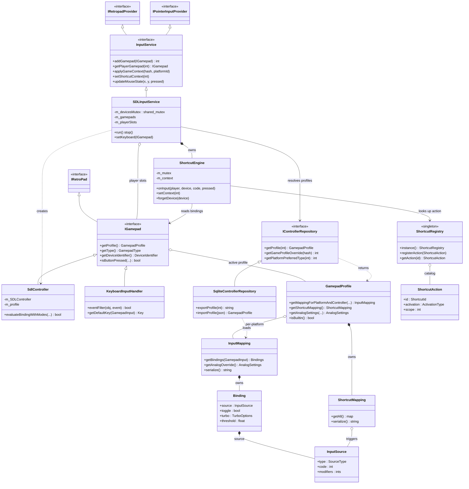

<!-- SCAFFOLD: the prose in this file was seeded from an automated read of the code so you can rewrite it in your own voice (see activity/ and achievements/ for the tone). The "How it works" bullets are the load-bearing facts that currently live only in comments — fold them into prose, then trim the inline comments. Delete this line when done. -->
# Firelight Input Module
Self-contained static lib that turns physical input devices (SDL gamepads + the keyboard) into libretro RetroPad/pointer input for the running core, and owns the whole input-config model: per-device profiles, per-platform/per-controller-type bindings, analog tuning, and global keyboard/gamepad shortcuts. It is the app's implementation of the libretro IRetropadProvider/IPointerInputProvider interfaces.

## How it works

---

**Entry point:** InputService (abstract interface; the concrete impl is SDLInputService). The app constructs one SDLInputService, injects an IControllerRepository, sets the keyboard, and runs its SDL event loop on a dedicated thread. Everything else in the module hangs off it or the profile model it drives.

<!-- Load-bearing facts (thread rules, invariants, protocol ordering, gotchas). Rewrite as prose. -->
- Threading contract lives only in comments: SDLInputService::run() is a blocking SDL event loop on its own thread; the render thread reads pad+pointer state per frame; the GUI thread pushes mouse/keyboard events. m_devicesMutex is a shared_mutex — hot per-frame readers take shared locks, mutators unique. Connect/disconnect/order events MUST be published outside the lock because subscribers (ControllerListModel) re-enter to read slots; publishing under the lock deadlocks.
- ShortcutEngine::onInput runs on BOTH the SDL thread (controllers) and the GUI thread (keyboard). It detects edges under m_mutex, buffers ShortcutEvents, and publishes only AFTER releasing the lock so a subscriber can't re-enter the engine and deadlock. Default context is ScopeInMenu (no game active until the UI calls setShortcutContext).
- forgetDevice(device) must be called on disconnect to drop held/latched shortcut state; SDLInputService calls it (and publishDisconnected) OUTSIDE m_devicesMutex because both take their own locks.
- Mouse/cursor state is intentionally lock-free atomics: UI thread writes absolute position (updateMouseState), emulation thread writes incremental (nudgeCursor), render thread reads. Whichever wrote last wins the shared cursor. Relative motion accumulates and is consumed (exchange-to-0) exactly once per frame by getRelativeMotion, so one value serves both the X and Y core queries.
- SdlController::evaluateBindingWithModes mutates per-binding toggle/turbo state and so MUST be evaluated exactly once per frame per binding; every binding on an input is evaluated (to keep state current) and results are OR'd. Toggle latches on the source's rising edge; turbo is a steady_clock square wave (pressed for the first half of each 1/rateHz cycle). setProfile() clears all latched toggle/turbo state. Per-binding state is keyed by (target<<8 | bindingIndex).
- InputFrame is the load-bearing netplay/replay primitive: a self-contained, serializable once-per-frame joypad snapshot captured in Core::pollInput so the core reads stable input during retro_run(). Fixed 10-byte little-endian wire format (2 bytes buttons + 4x2 axes); buttons bitmask is indexed by RETRO_DEVICE_ID_JOYPAD_* (0..15). Pointer/mouse/light-gun input is explicitly NOT part of this record yet.
- GamepadInput encoding is an ABI-like invariant: joypad ids 0..15 equal RETRO_DEVICE_ID_JOYPAD_*; MOUSE_INPUT_MASK (1<<9) and LIGHTGUN_INPUT_MASK (1<<10) namespace non-joypad inputs with the raw RETRO_DEVICE_ID_* in the low byte (recover via retroDeviceId/classOf). GamepadInputClass values double as the input-mapping controllerType key, and Joypad==1 is chosen specifically to keep already-persisted joypad mappings valid.
- Profile resolution priority (resolveProfileForGamepad): an active per-game override (looked up by library content hash) wins over the device's stored default profile; if a device has no stored profile one is created and its DeviceInfo persisted. applyGameContext additionally promotes a connected controller whose GamepadType matches the platform's preferred type to player one, and a CLI --controller session preference wins over the stored platform preference.
- The keyboard is deliberately modeled as just another IGamepad (DeviceType::Keyboard) — same slot-assignment and profile-resolution path, no special-casing. Its profile is flagged isKeyboardProfile purely so the UI shows key labels instead of button labels, and it uses the sentinel DeviceIdentifier (-1,-1,-1). With preferGamepadOverKeyboard set, a newly connected gamepad bumps the keyboard out of the earliest slot it holds.
- Devices are identified by stable USB vendor/product/version, so two identical controllers share one identity and one profile.
- getRetropadForPlayerIndex returns a shared_ptr (up-cast from IGamepad) specifically so a caller can keep using the device across an unplug mid-frame without a dangling pointer.
- Config model persists through a sync-callback pattern: InputMapping and ShortcutMapping hold a syncCallback invoked on mutation so edits write back through SqliteControllerRepository. Bindings/shortcuts serialize compactly (only non-default fields emitted) and whole profiles export/import as portable JSON.
- Built-in profiles are read-only and cannot be deleted — editing one is expected to clone it to a user profile first (isBuiltin()). The default shortcut catalog (registerDefaultShortcuts) is registered once at startup; trigger bindings are stored per profile, not in the registry.
- Analog defaults are chosen for backward compatibility: AxisSettings default innerDeadzone 0.25 reproduces the old hardcoded 8192/32767 deadzone, and the SDL event loop uses the same 8192 (NAV_STICK_THRESHOLD) magnitude to convert stick deflection into digital directional presses for menu navigation.

## Architecture

---

Caption: Class diagram of the firelight_input module — the InputService abstraction (concrete SDLInputService) exposes per-player RetroPads and pointer input to the libretro core, driving IGamepad devices (SdlController, KeyboardInputHandler) that carry GamepadProfiles, and a value-owned ShortcutEngine that resolves triggers against the global ShortcutRegistry; SqliteControllerRepository persists profiles/mappings. Value structs, enums, and event/replay types are noted as omitted.

## Data Structures

---

### InputService _(interface)_
The module's front door. Abstract interface (implements libretro IRetropadProvider + IPointerInputProvider) exposing gamepad add/remove/list, player-slot lookup, gamepad-order changes, keyboard-vs-gamepad preference, mouse/pointer feed, game-context application (per-game profile + preferred controller type), and shortcut scope. Also defines the event structs published on the bus.

### SDLInputService _(class)_
The one concrete InputService. Runs the SDL event loop, opens SDL controllers as SdlControllers, owns the player-slot assignment logic (including bumping the keyboard when gamepads are preferred and promoting a device to player one for a platform's preferred type), resolves each device's profile via the repository, owns a ShortcutEngine, and holds all mouse state in atomics. THE runtime hub.

### IGamepad _(interface)_
Abstract input device (extends libretro::IRetroPad). Adds profile get/set, raw-input evaluation, identity (name, instance id, USB DeviceIdentifier), type/device-type, wired state, and disconnect. Both real gamepads and the keyboard implement it so the runtime never special-cases the keyboard.

### SdlController _(class)_
IGamepad backed by an SDL_GameController. Reads live SDL button/axis state, applies the active profile's bindings (OR-combining multiple bindings per emulated input, honoring modifiers/threshold/toggle/turbo), applies AnalogSettings to sticks/triggers, maps vendor/product ids to a GamepadType, and drives rumble.

### KeyboardInputHandler _(class)_
IGamepad + QObject that installs a Qt eventFilter, tracks key/button state, and publishes KeyboardKeyEvents so the shortcut engine treats the keyboard like any other device. Provides default key mapping and human-readable key labels. Uses the sentinel DeviceIdentifier (-1,-1,-1).

### IControllerRepository _(interface)_
Persistence contract for the config model: device info (identity -> display name + profileId), profiles (CRUD, clone, rename, analog settings, JSON export/import), per-platform preferred controller type, and per-game profile overrides keyed by library content hash.

### SqliteControllerRepository _(class)_
QtSql-backed IControllerRepository. Seeds per-platform mappings from the injected PlatformService, lazily creates mappings, loads a profile's per-platform InputMappings + ShortcutMapping, and wires sync callbacks so mutating a mapping persists back. Protects built-in profiles from deletion.

### GamepadProfile _(class)_
A named input profile owned/loaded by the repository and attached to a device. Aggregates per-(platform,controllerType) InputMappings, a ShortcutMapping, and default AnalogSettings; resolves the effective analog settings (mapping override else profile default). Carries builtin/read-only, keyboard-profile, based-on-type, and icon metadata.

### InputMapping _(class)_
The bindings for one (platform, controllerType) within a profile: each emulated GamepadInput maps to a list of physical Bindings (combined), plus an optional analog-tuning override. Serializes to JSON and invokes a sync callback on change. Keeps legacy simple-remap helpers over the primary binding.

### Binding _(struct)_
One physical source bound to an emulated input plus behavior: toggle (latch), turbo (autofire square wave), analog->digital threshold, and axis invert/scale. Multiple Bindings on the same input are OR'd/summed. Serializes compactly (only non-default fields emitted).

### InputSource _(struct)_
What a binding physically reads: a SourceType (Button / AxisPositive / AxisNegative / Key / None), a code (GamepadInput for pads, Qt::Key for keyboard), and optional modifier codes that must be held simultaneously (combos). Also the trigger unit for shortcuts.

### ShortcutEngine _(class)_
Edge-detects emulator shortcuts from raw device input (fed by both gamepad and keyboard) and publishes ShortcutEvents. Reads each triggering device's profile ShortcutMapping and the global ShortcutRegistry for activation type (Press/Hold/Toggle) and scope, honoring the current in-game/in-menu context. Owns held/satisfied/hold/latch state per device; forgetDevice clears it on disconnect.

### ShortcutRegistry _(class)_
Process-global singleton catalog of the shortcut actions the emulator supports (id, display name, category, activation type, scope, default triggers). Populated once at startup by registerDefaultShortcuts(); the engine and config UI read from it. Trigger bindings live separately, per profile.

### ShortcutMapping _(class)_
A profile's shortcut triggers: for each ShortcutId, a list of InputSource combos that fire it (alternates allowed). Serializes to versioned JSON and syncs back via callback.

### ShortcutAction _(struct)_
A catalog entry describing an action and how it behaves. Related enums: ActivationType (Press/Hold/Toggle), ShortcutScope (InGame/InMenu/Always bit flags), ShortcutPhase (Started/Ended), and the emitted ShortcutEvent (playerIndex, id, phase, toggledState).

### InputFrame _(struct)_
Once-per-frame joypad snapshot (16-button bitmask + 4 analog axes) captured so the core reads stable input during retro_run(). Self-contained + serializable to a fixed 10-byte little-endian wire form — designed as the record a replay/netplay layer would transmit. captureJoypadFrame() samples an IRetroPad into one. Pointer/mouse/light-gun input is not part of this record yet.

### AnalogSettings _(struct)_
Analog tuning bundle (leftStick/rightStick AxisSettings + left/right TriggerSettings). AxisSettings::apply() maps a raw ±32767 axis through inner/outer deadzone, response curve (Linear/Exponential), anti-deadzone, and sensitivity. Defaults reproduce the historical hardcoded 0.25 inner deadzone.

### GamepadInput _(enum)_
The emulator-neutral input namespace: joypad ids 0..15 mirror RETRO_DEVICE_ID_JOYPAD_*, sticks are 256+, and mouse (mask 1<<9) / light-gun (mask 1<<10) inputs pack their raw RETRO_DEVICE_ID_* in the low byte. Helpers classOf(), retroDeviceId(), defaultPhysicalBinding(), and displayName() derive class/labels. GamepadInputClass values double as the mapping's controllerType key (Joypad==1 preserves persisted mappings).

### DeviceIdentifier _(struct)_
Stable USB-style device identity (name, DeviceType, vendorId, productId, productVersion) used as the key for a device's stored DeviceInfo/profile; identical models share one identity. Keyboard uses the (-1,-1,-1) sentinel. GamepadType enumerates known controller models; DeviceType is the broad Gamepad/Keyboard class.
