<!-- SCAFFOLD: the prose in this file was seeded from an automated read of the code so you can rewrite it in your own voice (see activity/ and achievements/ for the tone). The "How it works" bullets are the load-bearing facts that currently live only in comments — fold them into prose, then trim the inline comments. Delete this line when done. -->
# Firelight Library Module
A self-contained static lib (firelight_library) that owns the user's game library. It scans watched folders for ROM/disc/patch files, identifies each file's platform and canonical RetroAchievements-compatible content hash, catalogues them in SQLite, and turns discovered content into playable library entries. It also serves the app-facing curation surface (entries, folders, smart folders, watched directories) and resolves/loads the actual bytes to hand a libretro core at launch.

## How it works

---

**Entry point:** UserLibraryService is the app-facing facade / entrypoint, but IUserLibraryRepository (concrete: SqliteUserLibraryRepository) is the shared persistence backbone that every other collaborator in the module takes by reference.

<!-- Load-bearing facts (thread rules, invariants, protocol ordering, gotchas). Rewrite as prose. -->
- The content hash is the canonical primary key of the whole system: it is the RetroAchievements-compatible rcheevos hash and links a ROM to its achievements, save data, and library entry. ContentHasher must apply platform-specific normalization before hashing - iNES/SNES header stripping, N64 byte-order swap, rcheevos buffer hash otherwise - or the hash won't match RA/other subsystems.
- ContentIdentifier (scan time, 'what is this file') and ContentLoader (launch time, 'give me the bytes') are deliberate counterparts and must apply the SAME normalization so a file's identified hash equals its loaded hash.
- LibraryScanner2 threading: QObject on GUI thread (watcher/timer callbacks land there); scans run on a worker thread. m_dirMtimeByPath is single-worker-owned (no lock) and empty at launch so the first scan is always full/deep. scheduleWatch() must marshal onto the main thread because QFileSystemWatcher is not thread-safe. Watched dirs are capped at 256; the 5-minute PERIODIC_SCAN is the actual correctness guarantee, the watcher is just a fast path.
- scanFinished is emitted ONLY when m_changesInScan > 0, so a periodic no-op rescan never flickers/refreshes the library UI. Deleting this guard would cause visible flicker.
- EventDispatcher delivery is synchronous and same-thread. Repository events published on the scan worker thread cause LibraryIngestService handlers to run synchronously on that worker thread; this is only safe because SqliteUserLibraryRepository uses a per-thread SQLite connection (plus a recursive_mutex).
- Ingest lifecycle invariant: a content file -> a run configuration -> a (possibly unhidden) Entry; when the LAST run configuration for a content hash is deleted, the Entry is HIDDEN, not deleted, so user state (saves/folders/favorites) survives a temporarily missing file.
- Entry.nameUserSet is a guard flag: metadata scraping must not overwrite a name the user edited.
- ContentFile.m_contentDirectoryId = -1 means the file belongs to no known content directory (imported before provenance tracking and unmatched by backfill). It is resolved by LONGEST path-prefix match and is the folder-source provenance smart folders filter on.
- SmartFolderCriteria semantics: AND across criteria, OR within a multi-valued criterion (platformIds, genres); an empty source means the whole library; malformed filterJson parses to empty/match-all rather than throwing, so a corrupt smart folder degrades to 'whole library' instead of breaking.
- Disc extensions are ambiguous (many consoles share iso/bin/cue/chd...), so a disc's platform can ONLY be determined by inspecting contents via rcheevos AUTO detection - never by extension. Cartridge extensions, by contrast, map to a platform via PlatformService::platformIdForExtension.
- Disc track-vs-sheet rule: when a raw track file (bin/img/mdf/nrg) sits next to a cue/gdi/ccd/m3u sheet, the scanner catalogues the SHEET, not the raw track, to avoid duplicate library entries. DiscMember.m_role is 'track' for cue/gdi members and 'disc' for m3u entries.
- readAllBytes() uses a single sized read on purpose: the std::istreambuf_iterator idiom reads a byte at a time and repeatedly reallocates, which is pathologically slow for large (hundreds-of-MB) DS ROMs.
- UserLibraryService constructor has a side effect: it creates the default content directory on disk and ensures it is watched, so the user never has to configure a primary games folder. This is not just a query facade.
- Patch association is currently a no-op: NullPatchAssociator is wired in until content-database patch matching (patches table linking patch hash -> known ROM) is implemented.
- ArchiveReader::forEachEntry hands each entry a LAZY byte reader; entries whose reader is never invoked are skipped without reading their payload - important for cheaply scanning large multi-file archives.

## Architecture

---

```mermaid
classDiagram
    direction TB

    class UserLibraryService {
        +getEntries() vector~Entry~
        +update(Entry) bool
        +listFolders() vector~FolderInfo~
        +getContentDirectories()
    }
    class IUserLibraryRepository {
        <<interface>>
        +createEntry(Entry) bool
        +createRunConfiguration(...)
        +getEntryWithContentHash(hash)
        +getRunConfigurations(hash)
    }
    class SqliteUserLibraryRepository {
        -m_db SQLite::Database
        -m_mutex recursive_mutex
        -resolveContentDirectoryId()
        -backfillContentDirectoryIds()
    }
    class LibraryScanner2 {
        +startScan() QFuture~bool~
        +watchPath(path)
        +setScanningSuspended(bool)
        -scanDirectory(path)
    }
    class LibraryIngestService {
        -m_library
        -3 event subscriptions
    }
    class ContentIdentifier {
        +identify(path) IdentifiedContent
        +identifyInArchive(...)
    }
    class ContentHasher {
        +hash(platformId, bytes) HashedContent
        +md5(data,len)$
    }
    class DiscInspector {
        +inspectFile(path,out) DiscIdentity
        +inspectArchiveEntry(...)
    }
    class ArchiveReader {
        +listEntries()
        +readEntryByPath(p)
        +forEachEntry(fn)
    }
    class ContentLoader {
        +load(ContentFile) LoadedContent
        +applyPatch(content,plat,patch)
    }
    class EntryResolver {
        +resolve(Entry) ResolvedContent
        -scoreConfig()$
    }
    class SmartFolderCriteria {
        +parse(json) SmartFolderCriteria$
        +matches(EntryFields) bool
        +isEmpty() bool
    }
    class PatchFile {
        +load() bool
        +getType() PatchType
        +patch(data) bytes
    }
    class Entry {
        +int id
        +string contentHash
        +bool nameUserSet
        +vector~int~ contentDirectoryIds
    }
    class EntryFields {
        +int platformId
        +bool favorite
        +string genres
        +int64 secondsPlayed
    }
    class ContentFile {
        +string m_contentHash
        +int m_contentDirectoryId
        +bool m_inArchive
    }
    class IPlatformService {
        <<interface>>
    }
    class EventDispatcher {
        <<singleton>>
    }
    class ContentType {
        <<enumeration>>
        Cartridge
        Disc
    }
    class FolderType {
        <<enumeration>>
        Manual
        Smart
    }
    class PatchType {
        <<enumeration>>
        UNKNOWN
        IPS
        BPS
        UPS
        XDELTA
    }

    IUserLibraryRepository <|-- SqliteUserLibraryRepository
    UserLibraryService --> IUserLibraryRepository : facade over
    LibraryScanner2 --> IUserLibraryRepository : catalogues into
    LibraryScanner2 --> IPlatformService : uses
    LibraryScanner2 ..> ContentIdentifier : creates
    LibraryScanner2 ..> ArchiveReader : creates
    LibraryIngestService --> IUserLibraryRepository : creates entries
    LibraryIngestService --> EventDispatcher : subscribes
    SqliteUserLibraryRepository --> EventDispatcher : publishes
    ContentIdentifier *-- ContentHasher : cartridge hash
    ContentIdentifier *-- DiscInspector : disc detect
    DiscInspector --> IPlatformService : uses
    ContentLoader ..> ArchiveReader : creates
    ContentLoader --> ContentHasher : normalize+hash
    ContentLoader --> PatchFile : applyPatch
    EntryResolver --> IUserLibraryRepository : reads run-configs
    EntryResolver ..> ContentFile : resolves
    SmartFolderCriteria --> EntryFields : matches()
    ContentFile o-- ContentType
    PatchFile o-- PatchType

    %% Omitted for readability: IPatchAssociator/NullPatchAssociator (no-op, future content-db matching);
    %% value/result structs ResolvedContent, LoadedContent, HashedContent, IdentifiedContent, DiscIdentity,
    %% IdentifiedDiscMember, RunConfiguration, DiscMember, ContentDirectory, FolderInfo/FolderEntryInfo, and
    %% the library_events.hpp event structs. FolderType belongs to FolderInfo (also omitted from arrows).
```

Entry-point claim holds: UserLibraryService is the app-facing facade (header comment: 'a thin, concrete facade over the repository'), and IUserLibraryRepository is the shared backbone taken by reference by every stateful collaborator (UserLibraryService, LibraryScanner2, LibraryIngestService, EntryResolver). The content-processing utilities (ContentIdentifier/ContentHasher/DiscInspector/ArchiveReader/ContentLoader) correctly do NOT hold the repository. No genuinely public type is missing beyond the intentionally-omitted value/result structs and the no-op IPatchAssociator/NullPatchAssociator pair, all listed in the trailing comment. Free-function helper headers (content_extensions.hpp, file_bytes.hpp) are not types and are rightly excluded.

## Data Structures

---

### UserLibraryService _(class)_
The app-facing curation facade (no Qt, no QObject). A thin concrete wrapper over IUserLibraryRepository exposing only what the GUI/emulation need: browse/update entries, manage folders, manage content directories. Owns the guarantee that a default content directory always exists - on construction it creates that folder on disk and ensures it is watched.

### IUserLibraryRepository _(interface)_
The full persistence contract for the library: overloaded create/update for every catalogued type, entry/folder/content-directory queries, run-configuration and disc-member CRUD. The shared backbone every collaborator depends on. Publishes domain events on mutations.

### SqliteUserLibraryRepository _(class)_
The only IUserLibraryRepository implementation. Owns a SQLite::Database (per-thread connection), does schema creation/migration (ensureColumnExists), resolves each content file to its content directory by longest path-prefix match (resolveContentDirectoryId), backfills provenance for legacy rows, and publishes EntryCreated/Updated + ContentFile/RunConfiguration/ContentDirectory events via EventDispatcher. Guarded by a recursive_mutex.

### LibraryScanner2 _(class)_
QObject that watches content directories with QFileSystemWatcher, runs scans on a worker thread, and drives identification+cataloguing of files it finds. Emits scanFinished only when the scan actually changed something (so periodic no-op rescans never flicker the UI). A 5-minute periodic rescan is the real correctness guarantee; the watcher is a best-effort fast path bounded to 256 watched dirs.

### LibraryIngestService _(class)_
Scan-time orchestration that keeps the repository free of domain logic. A plain (non-QObject) class driven purely by repository events: on ContentFileAdded it creates a run configuration; on RunConfigurationCreated it ensures/unhides an Entry; when the last run configuration for a content hash is deleted it hides that entry (preserving user state).

### ContentIdentifier _(class)_
Scan-time counterpart to ContentLoader: determines WHAT a file is (platform + canonical content hash + file metadata) without loading it for play, for both loose files and archive entries. Delegates disc images to DiscInspector and cartridge hashing to ContentHasher.

### ContentHasher _(class)_
Computes the launch-ready content bytes and the canonical RetroAchievements-compatible content hash for non-disc ROMs, applying platform-specific normalization (iNES/SNES header stripping, N64 byte-order swap, rcheevos buffer hash otherwise). Also provides a static lowercase-hex MD5 for whole-file hashes.

### DiscInspector _(class)_
The disc-specific side ContentIdentifier delegates to: identifies disc images (loose or inside an archive) via rcheevos AUTO detection and resolves a multi-file disc set's members (cue/gdi tracks, m3u-listed discs). Extracts archived disc sets to a temp dir; has special-case Saturn magic detection.

### ArchiveReader _(class)_
Thin std-typed wrapper over libarchive centralizing archive handling that was previously duplicated across scanner/identifier/loader. Lists entries (headers only), reads an entry by path or base name, extracts a set of wanted entries to a dir, and offers single-pass forEachEntry with a lazy per-entry byte reader (skips payloads you never read).

### ContentLoader _(class)_
Launch-time counterpart to ContentIdentifier: reads a ROM (on disk or from an archive via ArchiveReader), produces the normalized bytes the core expects plus the content hash (via ContentHasher), and can apply a PatchFile to already-loaded content and recompute the hash.

### EntryResolver _(class)_
Chooses the 'most correct' content to launch for a library Entry from among its run configurations, returning a ResolvedContent (chosen ContentFile + optional PatchFile). Scores candidate configs and checks that the underlying content file still exists on disk.

### SmartFolderCriteria _(struct)_
Criteria defining a smart folder's live membership, split into SOURCE (which content directories / path-substring pool) and FILTERS (platform, favorite, genres, developer/publisher substrings, year range, play history). AND across criteria, OR within a multi-valued one; empty = whole library. Parses from JSON (malformed -> empty/match-all rather than throwing) and evaluates matches() as a pure predicate over EntryFields.

### Entry _(struct)_
A library entry: the user-facing game record keyed by contentHash, with display metadata (name, boxart, developer, release year, genres), state flags (hidden, favorite, activeSaveSlot), and filesystem provenance (folderIds, contentDirectoryIds, contentPaths). nameUserSet guards a user-edited name from being overwritten by scraped metadata.

### ContentFile _(struct)_
A catalogued ROM or disc image. Launchable identity is m_contentHash; m_filePath/m_inArchive/m_archivePathName locate the raw bytes. m_contentDirectoryId (folder-source provenance for smart folders) is resolved by longest path-prefix match, -1 when it belongs to no known directory.

### PatchFile _(class)_
A discovered ROM patch (IPS/BPS/UPS/XDELTA). Lazily load()s and wraps a firelight::patching::IRomPatch, exposes getType() and patch(bytes)->bytes, and carries the target/patched MD5s and patched content hash used to associate the patch with the ROM it modifies.

### FolderInfo _(struct)_
A user folder. Manual folders hold hand-picked FolderEntryInfo members; Smart folders (type=Smart) compute membership live from filterJson (serialized SmartFolderCriteria) and have no member rows. Also carries appearance (color, remembered sort role/direction) and nesting/ordering (parentId, position).

### IPatchAssociator / NullPatchAssociator _(interface)_
Interface for associating a discovered PatchFile with the ROM(s) it targets (creating run configurations for patched content). Intended backing is the read-only content database's patches table; that matching is a future feature, so NullPatchAssociator is the current no-op implementation.

### ContentType _(enum)_
Cartridge (single self-contained ROM) vs Disc (single image or the primary cue/gdi/m3u sheet of a multi-file set whose members live in disc_members).

### FolderType _(enum)_
Manual (hand-picked members via folder_entries) vs Smart (membership computed live from filterJson, no member rows).

### PatchFile::PatchType _(enum)_
The patch format detected for a PatchFile.

### Value structs _(struct)_
Small POD carriers passed between collaborators: ResolvedContent (EntryResolver output), LoadedContent/HashedContent (loader/hasher bytes+hash), IdentifiedContent/DiscIdentity/IdentifiedDiscMember (identifier/inspector output), EntryFields (pure inputs to SmartFolderCriteria::matches), RunConfiguration, DiscMember, ContentDirectory, FolderEntryInfo, and the library_events.hpp event structs.
