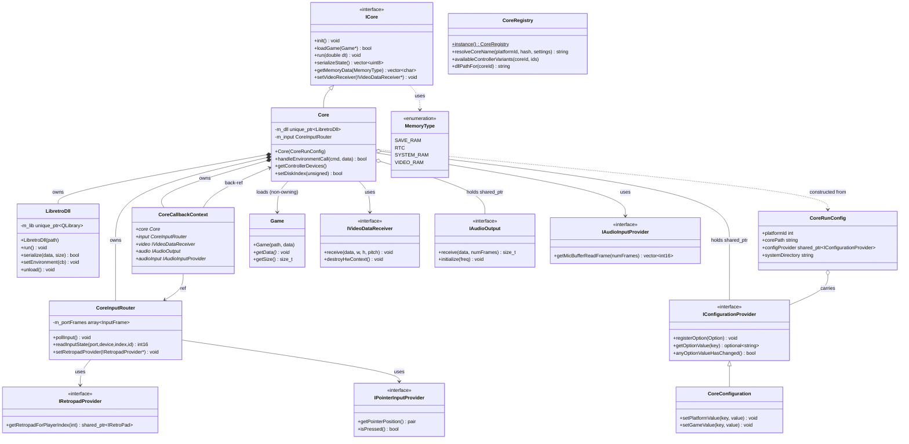

<!-- SCAFFOLD: the prose in this file was seeded from an automated read of the code so you can rewrite it in your own voice (see activity/ and achievements/ for the tone). The "How it works" bullets are the load-bearing facts that currently live only in comments — fold them into prose, then trim the inline comments. Delete this line when done. -->
# Firelight Libretro Module
The libretro ABI wrapper: it dlopen's a libretro core DLL and drives its full lifecycle (init/load/run/reset/serialize/cheats/disc-swap), translating between the core's C callbacks (video/audio/input/environment/mic) and Firelight's injected C++ interfaces. Deliberately free of Qt Quick / Qt Multimedia so a headless/CLI frontend could reuse it.

## How it works

---

**Entry point:** libretro::Core (the concrete implementation of the libretro::ICore interface; constructed from a firelight::libretro::CoreRunConfig)

<!-- Load-bearing facts (thread rules, invariants, protocol ordering, gotchas). Rewrite as prose. -->
- Single active core: only one core is supported at a time. The libretro C callbacks reach it through a single file-scope pointer g_ctx (CoreCallbackContext*), assigned in the Core constructor and set back to nullptr in ~Core. Every static trampoline (input/video/audio/env/mic) null-checks g_ctx before use.
- retro_set_environment runs INSIDE the Core constructor, so anything the core can query then (system/save directories, the configuration provider) MUST be passed via CoreRunConfig at construction, not through post-construction setters (documented in core_run_config.hpp).
- HW-render teardown order in ~Core is load-bearing for cores like PPSSPP/Vulkan: the frontend owns the VkDevice but the core keeps using it through retro_unload_game/retro_deinit. Order must be: run the core's context_destroy fn, then unloadGame(), then deinit(), then videoReceiver->destroyHwContext() (which calls the core's destroy_device) - all while the DLL is still loaded - and only THEN m_dll->unload(). LibretroDll::unload() is intentionally NOT in the destructor so Core controls this sequence.
- IVideoDataReceiver::destroyHwContext() is invoked by ~Core after context_destroy but before the DLL is unloaded; it must free every resource that needs DLL function pointers. Default no-op for non-Vulkan renderers.
- deserializeState() refuses (without touching the core) if the incoming data size != the current serialize size - a mismatch means the state is for a different game/core version and loading it would corrupt the running game.
- Environment-call dispatch: m_envHandlers (cmd -> {debug name, handler lambda}) is built lazily once on the first handleEnvironmentCall. Unknown/unhandled commands intentionally return false so the core falls back to its defaults (camera, location, MIDI, JIT, throttle, proc-address, etc. are deliberately declined). environmentCalls records handler names for debugging.
- LibretroDll constructor throws if the DLL fails to load or any required retro_* symbol is missing.
- CoreInputRouter::pollInput() snapshots pointer motion + each port's joypad InputFrame exactly once per frame; readInputState answers all per-id queries from that snapshot. IPointerInputProvider::getRelativeMotion() is consumed-on-read (resets the accumulator) and polled once per frame so one value serves both the X and Y queries.
- CoreRegistry is a singleton (instance()). resolveCoreName tier order: session override (CLI --core, not persisted) -> per-game override -> per-platform override -> platform default; an override is honored ONLY if that core supports the platform, otherwise it falls through. The override tiers are read from SettingsService under CORE_SETTING_KEY = "core".
- Controller-device resolution cross-references two sources: the curated CoreDeviceVariant catalog (friendly names, deviceClass, companion core-options) against the core's RUNTIME SET_CONTROLLER_INFO advertisement (ICore::getControllerDevices). availableControllerVariants filters the catalog to what the core advertised and synthesizes a standard Joypad default when the catalog offers none.
- RETRO_DEVICE_SUBCLASS(base,id) = ((id+1)<<8)|base is mirrored in core_registry.cpp to avoid pulling libretro.h into that TU. Base classes JOYPAD=1, MOUSE=2, LIGHTGUN=4.
- Bundled cores live under ./system/_cores/<os>/ with a per-OS DLL extension: .dll (Windows), .dylib (macOS/__APPLE__), .so (Linux). CoreInfo.bundled=false is reserved for user-supplied cores (a later phase).
- Disc swap sequence is eject(true) -> set_image_index(index) -> eject(false); the extended disk-control interface's callbacks are preferred over the base one. The core's disk-control struct is stored BY VALUE (m_diskControl/m_diskControlExt) because the struct the core passes via the env call may be transient.
- CoreConfiguration option precedence is game -> platform -> default, and it injects a variant's companionOptions when a controller variant is chosen so the core queries the expected input protocol (e.g. FCEUmm Zapper -> fceumm_zapper_mode=clightgun).
- platform_core_defaults.hpp is a legacy fallback for core-option defaults not yet in settings_catalog.json; consumed only by CoreConfiguration and slated for removal (config Phase 5).
- getPortInputClass returns a firelight::input::GamepadInputClass value; it defaults to 1 (Joypad) when a port's class was never set.
- Namespace split is deliberate: older low-level wrapper types (Core, ICore, LibretroDll, Game, CoreCallbackContext, MemoryType) sit in the plain libretro:: namespace; newer interfaces/providers and CoreInputRouter/CoreRunConfig sit in firelight::libretro::; CoreRegistry and CoreConfiguration sit in firelight::.
- NOTE: libs/firelight/libretro/include/core.hpp is currently just an empty stub (class Core {};) - an in-progress relocation target on the netplay branch. The real module code lives in src/app/libretro/ and is compiled into the firelight_emulation_lib CMake target (which also bundles the emulation-lifecycle sources: emulation_service, game_loader, core_settings_applier, emulator_instance).

## Architecture

---

Entry-point claim verified: the real type is `libretro::Core : public ICore` in src/app/libretro/core.hpp, constructed from `firelight::libretro::CoreRunConfig`. There is also an empty stub `firelight::libretro::Core{}` at libs/firelight/libretro/include/core.hpp — that placeholder is NOT the entry point and is correctly ignored. All 16 originally-claimed types and their kinds match code (MemoryType is an enum in icore.hpp with exactly SAVE_RAM/RTC/SYSTEM_RAM/VIDEO_RAM). Every rendered relationship checks out: Core composes LibretroDll (unique_ptr), CoreInputRouter (by value), CoreCallbackContext (by value); aggregates IConfigurationProvider and IAudioOutput (shared_ptr); holds raw refs to IVideoDataReceiver, IAudioInputProvider, Game; is constructed from CoreRunConfig. CoreRunConfig carries the config-provider shared_ptr. CoreInputRouter holds raw refs to IRetropadProvider/IPointerInputProvider. CoreCallbackContext back-references Core and CoreInputRouter. CoreConfiguration realizes IConfigurationProvider (namespace: global class, base firelight::libretro::IConfigurationProvider). CoreRegistry has no direct code edge to Core (it feeds the emulation layer that builds CoreRunConfig) and is correctly left free-floating. Namespaces: Core/ICore/MemoryType/LibretroDll/Game/CoreCallbackContext are in `libretro`; CoreInputRouter/CoreRunConfig/IConfigurationProvider/the provider+receiver interfaces are in `firelight::libretro`; CoreRegistry in `firelight`. Mermaid is syntactically valid (generics via ~...~, static marker `$` only at line-end on instance(), no mid-line `*` classifier collisions).

## Data Structures

---

### ICore _(interface)_
Abstraction over a loaded libretro core, kept to exactly the surface its consumers use: EmulatorInstance drives lifecycle/state, RAClient reads emulated memory for RetroAchievements. Core is the real dlopen'd impl; tests substitute a fake.

### Core _(class)_
THE entrypoint. Concrete ICore that owns the loaded DLL and holds all the state a libretro core can push via environment calls (system info, disk control, rumble, memory map, controller device options, etc.). Wires the static C trampolines to g_ctx and dispatches RETRO_ENVIRONMENT_* commands through a lazily-built handler table.

### LibretroDll _(class)_
Thin, policy-free wrapper over one loaded core DLL: owns the QLibrary and every resolved retro_* function pointer and forwards raw calls. Constructor throws if the DLL won't load or a required symbol is missing. unload() is explicit (not in the destructor) so Core controls HW teardown order.

### CoreInputRouter _(class)_
Per-frame input snapshot + libretro input-state translation (joypad, analog, mouse, light gun) built on top of the retropad + pointer providers. pollInput() snapshots each port once per frame; readInputState() answers the core's per-id queries from that snapshot.

### CoreCallbackContext _(struct)_
The indirection the C callbacks reach the active core through without seeing Core's members. A single instance lives inside Core; its address is published to the file-scope g_ctx on load and cleared on unload. Populated by Core's receiver/provider setters.

### CoreRunConfig _(struct)_
Everything a core needs at construction. Critically carries the directories and config provider because retro_set_environment runs INSIDE the Core constructor, so these can't be post-construction setters.

### IConfigurationProvider _(interface)_
Contract for supplying/resolving a core's options (core-options v1/v2 with categories). Core registers the options the DLL declares and reads back current values through this.

### CoreConfiguration _(class)_
The app's IConfigurationProvider. Resolves each core option through a game -> platform -> Firelight-default value precedence, sourcing friendly settings + default overrides from SettingsService (with platform_core_defaults.hpp as a legacy fallback). Decoupled from Platform / the settings catalog itself.

### CoreRegistry _(class)_
Process-wide singleton that is the authority on which cores exist, which platforms each can run, each platform's default core, and the curated controller-variant catalog. Resolves the effective core for a scope (session --core override -> per-game -> per-platform -> platform default) and maps coreId to an on-disk DLL path.

### Game _(class)_
A loaded ROM handed to Core::loadGame: a file path plus the raw content bytes (or just a path for need_fullpath cores). Non-owning from Core's perspective.

### IVideoDataReceiver _(interface)_
Frontend video sink the core pushes frames to; also negotiates HW (GL/Vulkan) render context, pixel format, rotation, and AV info. destroyHwContext() is called by ~Core at a precise point in teardown.

### IAudioOutput _(interface)_
Frontend audio sink + playback control (mute/pause/buffer level/dynamic rate control), injected as a shared_ptr so the emulation code doesn't depend on the Qt-Multimedia AudioManager.

### IRetropadProvider _(interface)_
Supplies the IRetroPad bound to a player slot (nullptr if empty). Returns a shared_ptr so a device stays alive even if unplugged mid-frame. Consumed by CoreInputRouter.

### IPointerInputProvider _(interface)_
Supplies pointer/mouse/light-gun input (absolute position, button, relative motion) to a running core; most methods default to no-ops so pointer-only impls and test doubles need not override. Consumed by CoreInputRouter for mouse/light-gun devices.

### MemoryType _(enum)_
libretro memory regions used for save-data extraction/restore.
