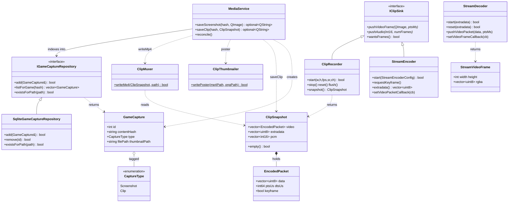

<!-- SCAFFOLD: the prose in this file was seeded from an automated read of the code so you can rewrite it in your own voice (see activity/ and achievements/ for the tone). The "How it works" bullets are the load-bearing facts that currently live only in comments — fold them into prose, then trim the inline comments. Delete this line when done. -->
# Firelight Media Module
A self-contained static lib (firelight_media) that owns everything media-capture and live-streaming for the emulator: saving screenshots, recording rolling "Instant Replay" gameplay clips as compressed H.264, muxing them to mp4 with poster thumbnails, indexing captures in a gallery database, and encoding/decoding a live H.264+Opus game stream for netplay. All ffmpeg lives behind narrow, mostly-Qt-free interfaces.

## How it works

---

**Entry point:** MediaService

<!-- Load-bearing facts (thread rules, invariants, protocol ordering, gotchas). Rewrite as prose. -->
- Free-after-join ordering: in ClipRecorder/StreamEncoder, all ffmpeg state (AVCodecContext, SwsContext, AVFrame, AVPacket) is created in start() and used ONLY by the worker thread; stop() does running.exchange(false), notifies the CV, JOINS the worker, and only THEN frees the ffmpeg objects. Reordering this (freeing before join) is a use-after-free.
- The rolling video ring is trimmed whole-GOP (trimVideoRing drops entire leading GOPs only while the buffer would still cover the window without them) so the front of the buffer, and thus every snapshot(), always begins on a keyframe. gop_size=fps gives a ~1s keyframe interval that makes this trim tight.
- ClipRecorder stores compressed H.264, never raw frames; max_b_frames=0 means pts==dts (no reordering, simplest mux) and AV_CODEC_FLAG_GLOBAL_HEADER puts SPS/PPS into extradata for the mp4/stream-copy path.
- snapshot() returns empty (ClipSnapshot::empty()) until at least one keyframe has been buffered; callers must handle the empty case (MediaService::saveClip bails on it).
- Hand-off queues are bounded to MAX_QUEUED_FRAMES=8 with drop-oldest backpressure; if the encoder falls behind, the oldest queued frame is dropped rather than letting the queue grow. Encode PTS is forced strictly monotonic across dropped frames (pts = lastPts+1).
- flush() blocks on idleCv until the worker has drained the queue, specifically so a following snapshot() includes the most recent gameplay. It is cheap (a few frames).
- Frame format contract: producers push RGBA8888. Premultiplied-opaque bytes are accepted without a conversion copy because with alpha==255 they are byte-identical to straight RGBA; anything else is converted. Retro frames are integer nearest-neighbor (SWS_POINT) upscaled to ~720 lines and dims are forced even for YUV420.
- ClipMuxer::writeMp4 is a PURE function of ClipSnapshot (carries no ffmpeg state) - the video is stream-copied (already encoded), PTS/DTS are rebased so playback starts at 0, and dts is clamped to <= pts. This is what makes it unit-testable with synthetic snapshots.
- Audio muxing into clips (PCM -> AAC) is NOT implemented yet - a documented planned follow-up. snapshot.pcm is carried all the way through ClipSnapshot and into ClipMuxer but is currently discarded when writing the mp4.
- StreamEncoder emits self-contained IDRs (x264 forced-idr + repeat-headers=1) so a netplay receiver can join or reconnect mid-stream; requestKeyframe() forces the next encoded frame to an IDR. Output audio is always 48kHz Opus regardless of the core's input sample rate (resampled via swresample).
- StreamEncoder/StreamDecoder callbacks fire on internal/worker threads (encoder) or the calling thread (decoder is synchronous) and must be set BEFORE start(). StreamEncoder audio encodes inline on the caller's thread behind audioMutex while video encodes on the worker.
- IClipSink::wantsFrames() defaults to true; producers may skip expensive GPU framebuffer readback when it is false, and the netplay sender returns false until armed.
- Capture disk layout is load-bearing for reconcile: files live at <capturesDir>/{screenshots|clips}/<contentHash>/<epochMs>.{png|mp4}, and the filename stem IS the epoch-ms timestamp (recovered on reconcile, falling back to the file's mtime). Splitting by content hash is what lets the gallery group by game.
- SqliteGameCaptureRepository relies on a UNIQUE index on file_path so add() is an idempotent INSERT OR IGNORE followed by a read-back of the row id; existsForPath/reconcile depend on this uniqueness. Schema evolves via forward-only numbered migrations (migration_runner) - add the next-numbered migration, never edit an existing one.
- reconcile() is the self-healing path: it indexes on-disk-but-unindexed files (regenerating a missing clip poster if absent), then prunes index rows whose backing files were deleted outside the app. Safe to call at startup or on manual refresh.

## Architecture

---

Verified against all 11 public headers plus media_service.cpp (writeMp4/writePoster/GameCapture/CaptureType usage confirmed). Draft was accurate on types and relationships; only Mermaid-syntax/consistency fixes were needed. Note: StreamEncoder/StreamDecoder form a parallel netplay-streaming path that is NOT owned by MediaService — they share only the IClipSink abstraction with the Instant-Replay path.

## Data Structures

---

### MediaService _(class)_
The module entrypoint. Owns the on-disk capture layout (<capturesDir>/screenshots/<hash>/<epochMs>.png and clips/<hash>/<epochMs>.mp4, split by content hash so the gallery groups by game) and records every capture in the index. saveScreenshot writes a PNG; saveClip muxes a ClipSnapshot to mp4 plus a poster; reconcile re-syncs the index with disk (indexing new files, regenerating missing posters, pruning rows for deleted files).

### IClipSink _(interface)_
The narrow boundary the render + audio threads push into while recording/streaming. Deliberately free of ffmpeg types so producers (emulator renderer, AudioManager) and tests depend only on this abstraction. wantsFrames() lets producers skip expensive GPU readback when the sink is idle (the netplay sender returns false until armed; default true).

### ClipRecorder _(class)_
The Instant Replay recorder and the primary IClipSink implementation. Keeps the last N seconds of play as a rolling window of already-compressed H.264 packets (trimmed whole-GOP so the front is always a keyframe) plus a small rolling PCM ring. snapshot() lifts the current window out as a plain ClipSnapshot. Integer nearest-neighbor upscales tiny retro frames to ~720 lines so clips stay pixel-sharp.

### StreamEncoder _(class)_
Live game-stream encoder for netplay and the other IClipSink implementation. Emits a continuous H.264 (bitrate-capped, self-contained IDRs via forced-idr/repeat-headers so a receiver can join mid-stream) + Opus (always 48kHz, resampled from the core rate) stream through callbacks - no ring, no file. requestKeyframe() forces the next frame to an IDR for reconnect recovery.

### StreamDecoder _(class)_
The netplay receiver's counterpart to StreamEncoder: decodes a live H.264 + Opus 48kHz stereo stream synchronously, firing a callback with a raw-RGBA StreamVideoFrame (or interleaved int16 audio) before push* returns. reset() tears down and re-arms for a mid-stream resolution change.

### ClipMuxer _(class)_
Writes a buffered clip to an mp4. Stateless (single static writeMp4) and a pure function of the ClipSnapshot - the H.264 was already produced by ClipRecorder so it is stream-copied here (no re-encode), with PTS/DTS rebased to start at zero. Audio muxing (PCM->AAC) is a documented planned follow-up; snap.pcm is carried through but not yet written.

### ClipThumbnailer _(class)_
Stateless helper that decodes the first video frame of an mp4 and saves it as a PNG gallery poster.

### ClipSnapshot _(struct)_
A self-contained, ffmpeg-free description of a clip ready to become an mp4: a run of H.264 EncodedPackets beginning on a keyframe, the codec extradata (SPS/PPS) for stream setup, and interleaved stereo int16 PCM for the same window. Because it carries no ffmpeg state, ClipMuxer::writeMp4 can be unit-tested with synthetic input. empty() is true until at least one keyframe is buffered.

### EncodedPacket _(struct)_
One already-encoded H.264 video packet lifted out of the rolling buffer. Timestamps are in microseconds so the muxer can rebase them without knowing the codec.

### StreamVideoFrame _(struct)_
One decoded frame as raw tightly-packed RGBA8888 pixels; deliberately Qt-free so the display layer wraps it however it likes. StreamDecoder's video output type.

### StreamEncoderConfig _(struct)_
Config passed to StreamEncoder::start: geometry, fps, input PCM sample rate (output is always 48kHz Opus), channels, and target bitrate.

### IGameCaptureRepository _(interface)_
The gallery's index of captured screenshots/clips. add() is idempotent by file path and stamps the id; the rest is CRUD plus existsForPath (used by reconcile).

### SqliteGameCaptureRepository _(class)_
SQLite-backed implementation of the capture index (captures.db). Schema is created via forward-only numbered migrations (migration_runner); a UNIQUE index on file_path makes add() an INSERT OR IGNORE that then reads the id back. All access is serialized by a recursive_mutex.

### GameCapture _(struct)_
One indexed media file for the gallery. filePath is the .png/.mp4; thumbnailPath is what the grid shows (the screenshot itself, or a clip's poster). The filename stem is its epoch-ms timestamp.

### CaptureType _(enum)_
Discriminates a GameCapture as a still Screenshot (0) or a gameplay Clip (1); also drives reconcile's per-type scan and poster generation.
