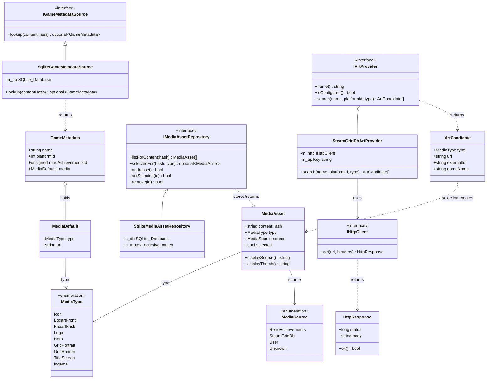

<!-- SCAFFOLD: the prose in this file was seeded from an automated read of the code so you can rewrite it in your own voice (see activity/ and achievements/ for the tone). The "How it works" bullets are the load-bearing facts that currently live only in comments — fold them into prose, then trim the inline comments. Delete this line when done. -->
# Firelight Metadata Module
Self-contained static lib that answers two related questions about a game identified by its content hash: (1) what do we know about it — title, developer, publisher, genre, release info, RetroAchievements id, platform, and default media URLs — resolved from the read-only game-metadata database shipped with the app; and (2) which pictures should we show — a per-game store of user-chosen media assets (icons, box art, logos, heroes, grids) plus art providers that search external services (currently SteamGridDB) for artwork candidates the user can pick from.

## How it works

---

**Entry point:** IGameMetadataSource (implemented by SqliteGameMetadataSource) — the namesake/primary seam. NOTE: unlike activity/achievements there is no single facade service; the module exposes three coordinate interfaces the app wires up independently: IGameMetadataSource (lookup by content hash), IMediaAssetRepository (store selected art), and IArtProvider (search external art).

<!-- Load-bearing facts (thread rules, invariants, protocol ordering, gotchas). Rewrite as prose. -->
- MediaType enum values are PERSISTED as integers in the DB — the header explicitly says 'Don't change the numbers'. Renumbering silently corrupts every stored media_type. (game_metadata.hpp)
- MediaSource is persisted as TEXT via toString()/mediaSourceFromString() ('retroachievements'/'steamgriddb'/'user'/'unknown'); those exact strings are a stable on-disk contract, and any unrecognized value round-trips to Unknown. (media_asset.cpp)
- In SqliteMediaAssetRepository the media_assets table stores nullable text columns as '' (empty string) NOT NULL — comment: this is required so the UNIQUE index (content_hash, media_type, source, external_id, remote_url) actually dedupes; SQLite treats NULLs as distinct. (sqlite_media_asset_repository.cpp)
- add() is an upsert with a specific 3-step protocol: INSERT OR IGNORE (always with selected=0), then SELECT the id via the unique key (existing or new), then UPDATE only the mutable fields thumb_url/local_path/width/height — the comment notes 'a re-add can update a cached local path/size'. Selection is applied last, only if asset.selected, via setSelected(). asset.id is back-filled by reference; returns false if id couldn't be resolved.
- At most ONE asset may be selected per (contentHash, type). setSelected() enforces this inside a SQLite::Transaction: clear selected=0 for all rows of that (content_hash, media_type), then set selected=1 on the chosen id. (sqlite_media_asset_repository.cpp)
- SqliteMediaAssetRepository's m_mutex is a std::recursive_mutex ON PURPOSE — add() calls setSelected() while already holding the lock, so a non-recursive mutex would deadlock.
- SqliteGameMetadataSource opens the DB OPEN_READONLY and tolerates a missing file: constructor catches, logs a warning ('It's fine if we don't find it, we just won't have metadata available'), and resets m_db; lookup() then returns nullopt whenever m_db is null. It never throws to callers.
- GameMetadata is deliberately NOT what a library entry stores — comment: it comes from the metadata source and is used to POPULATE a library entry when the user adds a game. MediaAsset, by contrast, is the concrete stored/displayable art created when a user selects a candidate.
- IHttpClient is a deliberate seam: comment says it exists 'so art providers can be unit-tested with a fake and the module stays free of a concrete HTTP dependency (cpr lives in the app)'. The concrete HTTP client is injected by reference from the app; this module must not gain a cpr dependency.
- SteamGridDbArtProvider search fan-out is bounded and fault-tolerant: MAX_GAMES=6 autocomplete matches, MAX_CANDIDATES=60 total across games, aggregated best-first (first-matched game first). collectArtForGame returns silently on a non-OK response — comment: 'one game's art failing shouldn't sink the whole search'. Unsupported MediaType (endpointForType == '') and an empty apiKey both short-circuit to zero HTTP calls.
- SteamGridDB MediaType->endpoint mapping is load-bearing: Icon->icons, Logo->logos, Hero->heroes, and BoxartFront/GridPortrait/GridBanner all->grids; everything else is unsupported (no request made). Auth is 'Bearer ' + apiKey against https://www.steamgriddb.com/api/v2.
- MediaAsset display precedence: displaySource() = remoteUrl if non-empty else localPath; displayThumb() = thumbUrl if non-empty else displaySource(). Comment/tests: the full-res url stays the persisted source while small surfaces (picker grid) use the thumb.
- The shipped metadata schema is encoded only in the lookup SQL: games (id,name,description,developer,publisher,genre,release_year,release_date,region,players,ra_game_id,platform_id) joined via game_hashes(content_hash->game_id), with default art in game_media(media_type,url). Content hash is the join/lookup key. (sqlite_game_metadata_source.cpp)

## Architecture

---

The metadata module has no single facade: three independently-wired seams — IGameMetadataSource (read-only sqlite lookup by content hash), IMediaAssetRepository (persist user-selected art), and IArtProvider (search external art via SteamGridDB over an injected IHttpClient). Shared value types MediaType/MediaSource/GameMetadata/MediaAsset tie them together.

## Data Structures

---

### IGameMetadataSource _(interface)_
The source of game metadata for a content hash. Implementations may resolve from a local DB, a remote service, or anywhere else. Single method: lookup(contentHash) -> optional<GameMetadata>.

### SqliteGameMetadataSource _(class)_
Read-only source backed by the game-metadata database that ships with the app. Opens OPEN_READONLY; if the file is missing it logs a warning and simply returns no metadata (never throws to the caller). lookup joins games <- game_hashes on content_hash, then pulls default media rows from game_media.

### GameMetadata _(struct)_
A set of metadata for a game FROM the metadata source. Explicitly NOT what a library entry stores — it is used to POPULATE a library entry when the user adds a game. Carries name/description/developer/publisher/genre, releaseYear/releaseDate, region, players, retroAchievementsId, platformId, and a vector of MediaDefault URLs.

### MediaDefault _(struct)_
A default media asset for a game as advertised by the metadata source: a MediaType plus a URL. These are candidate defaults, distinct from the concrete MediaAsset rows the repository stores.

### MediaType _(enum)_
The kind of media asset. LOAD-BEARING: the integer values are persisted in the database — do not renumber. Icon is the square library-grid tile; Grid/Boxart/Logo/Hero/etc. map to SteamGridDB endpoints.

### MediaSource _(enum)_
Where a media asset came from. Persisted as text via toString()/mediaSourceFromString() (retroachievements/steamgriddb/user/unknown), so the string mapping must stay stable.

### MediaAsset _(struct)_
A single concrete, storable/displayable media asset for a game — what gets created when the user selects an art candidate. Identified in the DB by (contentHash, media_type, source, external_id, remote_url). Has display helpers: displaySource() prefers remoteUrl then localPath; displayThumb() prefers thumbUrl then falls back to displaySource().

### IMediaAssetRepository _(interface)_
Stores and retrieves the user's media assets per game. Invariant: at most one asset selected per (contentHash, type). add() is an upsert keyed on (contentHash,type,source,externalId,remoteUrl) that back-fills asset.id; setSelected() flips selection atomically; remove() deletes by id.

### SqliteMediaAssetRepository _(class)_
Sqlite implementation of the media-asset store (opens READWRITE|CREATE, self-creates the media_assets table + indexes on first use). Optional text columns default to '' not NULL so the unique dedup index actually dedupes. add() does INSERT OR IGNORE, re-SELECTs the id via the unique key, UPDATEs the mutable fields (thumb_url/local_path/width/height so a re-add can refresh a cached path/size), then applies selection. Guarded by a recursive mutex.

### IArtProvider _(interface)_
Provides artwork CANDIDATES for a game (from a remote API or local DB). Reports a name() and isConfigured() (has API key etc.) for logging/UI, and search(gameName, platformId, type) -> candidates. When the user picks a candidate it gets stored as a MediaAsset.

### ArtCandidate _(struct)_
One artwork candidate returned by an art provider: full-res url, a thumbUrl for the picker grid (may equal url), dimensions, a provider-specific externalId, and the gameName it matched (may differ from the search query). Selecting one becomes a MediaAsset.

### SteamGridDbArtProvider _(class)_
IArtProvider that fetches art from steamgriddb.com via an injected IHttpClient (Bearer <apiKey>). isConfigured() == apiKey non-empty. search() maps MediaType to an endpoint (icons/logos/heroes/grids; unsupported types make zero calls), autocompletes up to MAX_GAMES=6 games, then aggregates art across them up to MAX_CANDIDATES=60, best (first-matched game) first; a single game's failed art fetch is skipped, not fatal.

### IHttpClient _(interface)_
Minimal HTTP GET seam (get(url, headers) -> HttpResponse). Exists so art providers can be unit-tested with a fake and so the module stays free of a concrete HTTP dependency — cpr lives in the app, which injects the real client. HttpResponse carries status+body and an ok() helper (2xx).

### HttpResponse _(struct)_
Result of an IHttpClient GET: long status, string body, and ok() == (200 <= status < 300).
