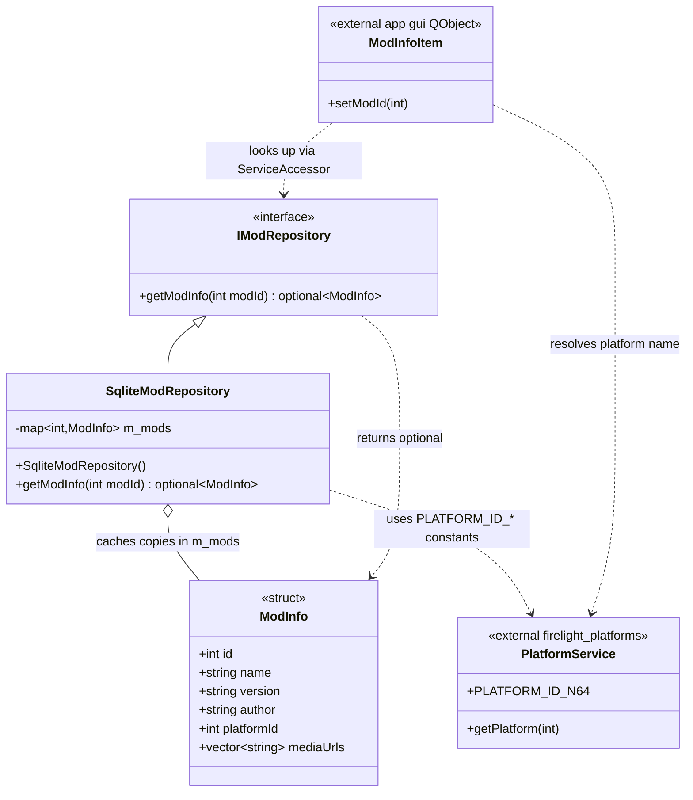

<!-- SCAFFOLD: the prose in this file was seeded from an automated read of the code so you can rewrite it in your own voice (see activity/ and achievements/ for the tone). The "How it works" bullets are the load-bearing facts that currently live only in comments — fold them into prose, then trim the inline comments. Delete this line when done. -->
# Firelight Mods Module
A tiny read-only catalog of curated ROM-hack "mods". Given a numeric mod id it hands back a ModInfo value object describing the hack — its name, author, version, the retail game it targets, the platform, and Qt-resource URLs for logo/screenshot artwork. It is metadata-only: it neither downloads nor applies patches.

## How it works

---

**Entry point:** IModRepository (the interface consumers depend on; the app wires in the concrete SqliteModRepository)

<!-- Load-bearing facts (thread rules, invariants, protocol ordering, gotchas). Rewrite as prose. -->
- MISLEADING NAME: SqliteModRepository does NOT use SQLite or any database. All data is hardcoded in the constructor into an in-memory std::map<int, ModInfo>. This is placeholder/seed data, not a real persistence layer.
- There are exactly five mods, keyed by ids 1 through 5 (Mario Kart 64: Amped Up, Pokémon Radical Red, Tajna and the Mana Seeds, Ultimate Goomboss Challenge, Super Mario 64: Beyond the Cursed Mirror). getModInfo returns an empty std::optional for any other id.
- ModInfo::id is NEVER populated by the repository — the constructor uses designated initializers starting at .name, so every entry's id field defaults to 0. Callers must treat the map key (the modId argument) as the identity, not ModInfo::id.
- targetContentHash — the field meant to bind a mod to a specific ROM — is empty for four of the five mods; only mod 5 (Beyond the Cursed Mirror) has a real hash ("20b854b239203baf6c961b850a4a51a2"). tagline/description are also empty for the earliest entries.
- clearLogoUrl and every entry in mediaUrls are Qt resource paths ("qrc:images/mods/..."), i.e. artwork is compiled into the app's qrc bundle, not fetched over the network.
- CONSUMER CONTRACT GOTCHA (in the external app-side ModInfoItem.cpp, not this lib): the null-check for a missing mod is commented out, so setModId dereferences the returned std::optional unconditionally. Passing a modId outside 1..5 dereferences an empty optional — undefined behavior / crash. The repository's 'empty optional means unknown id' contract is currently not honored by its main caller.

## Architecture

---

The `mods` lib exposes a single interface, `IModRepository`, whose sole concrete implementation `SqliteModRepository` seeds an in-memory `std::map<int, ModInfo>` in its constructor (platform ids sourced from `PlatformService`). The app-side `ModInfoItem` QObject is the external consumer, resolving mods via `ServiceAccessor` and platform names via `PlatformService`.

## Data Structures

---

### ModInfo _(struct)_
Plain value/DTO carrying everything the UI needs to show one mod: id, name, version, author, targetGameName, targetContentHash, platformId, tagline, description, clearLogoUrl, and a vector of mediaUrls. No behavior — copied by value out of the repository.

### IModRepository _(interface)_
The module's public contract and entrypoint: a single lookup, getModInfo(modId), returning an optional<ModInfo> (empty when the id is unknown). Consumers depend only on this interface, obtained through the app's ServiceAccessor.

### SqliteModRepository _(class)_
The one concrete IModRepository. Despite the 'Sqlite' name it touches no database at all — its constructor hard-codes five curated ROM hacks into an in-memory std::map<int, ModInfo>, and getModInfo is a map lookup. Effectively a stub/seed data source standing in for a future real backing store.
