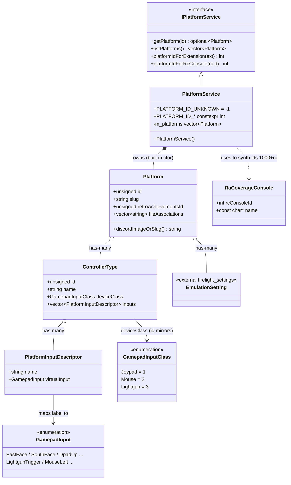

<!-- SCAFFOLD: the prose in this file was seeded from an automated read of the code so you can rewrite it in your own voice (see activity/ and achievements/ for the tone). The "How it works" bullets are the load-bearing facts that currently live only in comments — fold them into prose, then trim the inline comments. Delete this line when done. -->
# Firelight Platforms Module
A self-contained static library that hardcodes Firelight's catalog of emulated consoles ("platforms") and answers lookup queries about them: get a platform by id, list all platforms, resolve a file extension to a platform, and map an rcheevos console id to a Firelight platform id. Each platform bundles its display metadata, native controller layouts, and per-platform emulation settings.

## How it works

---

**Entry point:** PlatformService (implements IPlatformService)

<!-- Load-bearing facts (thread rules, invariants, protocol ordering, gotchas). Rewrite as prose. -->
- ControllerType.id intentionally mirrors deviceClass (Joypad=1, Mouse=2, Lightgun=3) so that existing joypad mappings (key 1) stay valid; which concrete device variants are actually selectable comes from the per-core catalog, NOT from ControllerType.
- Platform-id scheme is a two-tier system: consoles Firelight fully models get small legacy ids (the PLATFORM_ID_* constants). Every other RA-supported console gets a PROVISIONAL id of 1000 + rcheevos console id, and platformIdForRcConsole() returns that provisional id in its default branch. RC_CONSOLE_UNKNOWN maps to PLATFORM_ID_UNKNOWN (-1).
- RA_COVERAGE_CONSOLES entries are added to m_platforms as identity-only Platforms (only id, name, abbreviation, retroAchievementsId set — no controllers, extensions, or settings) purely so their names render in the library; their names mirror the previous PlatformMetadata::getPlatformName mapping. A handful of legacy-id consoles (Virtual Boy, Saturn, 32X, Sega CD, PS2) are likewise identity-only for now.
- platformIdForExtension() lowercases the extension and matches against fileAssociations; the interface contract says these are cartridge extensions only — ambiguous disc extensions are meant to be identified by content, not extension. Note in practice iso/cue/cso/pbp ARE listed for PS1/PSP, so extension lookup for those is best-effort.
- discordImage empty means fall back to slug — always go through Platform::discordImageOrSlug() rather than reading discordImage directly.
- JSON (de)serialization is lossy and asymmetric, a real gotcha: Platform from_json/to_json both OMIT emulationSettings entirely, and ControllerType from_json/to_json both OMIT imageUrl. JSON keys are snake_case (retro_achievements_id, file_associations, discord_image, controller_types, device_class, gamepad_input) and do not match the C++ field names.
- The catalog is 100% hardcoded in the constructor — there is no runtime loading from content.db or JSON despite the from_json/to_json helpers existing (they appear to be legacy/unused-at-runtime plumbing). Adding a platform means editing platform_service.cpp and, if it needs a stable id, adding a PLATFORM_ID_* constant.
- Build coupling gotcha: this module includes firelight/input/gamepad_input.hpp and rcheevos/rc_consoles.h but its CMakeLists only links firelight_settings and nlohmann_json PUBLIC — the input and rcheevos headers resolve via ${CMAKE_SOURCE_DIR}/include and transitive include paths, so it silently depends on those being present.

## Architecture

---

Verified against libs/firelight/platforms headers and src/platform_service.cpp. All 6 types, both enums, and all 8 relationships match the code exactly; entrypoint (PlatformService implements IPlatformService) confirmed. Enum values confirmed via include/firelight/input/gamepad_input.hpp (GamepadInputClass Joypad=1/Mouse=2/Lightgun=3). One caveat: RaCoverageConsole is an internal anonymous-namespace struct in platform_service.cpp, not a public API type, but including it to illustrate the 1000+rc identity-platform synthesis is reasonable. Mermaid is syntactically valid for GitHub (type-first member ordering avoids any trailing */$ classifier collisions). No changes needed.

## Data Structures

---

### IPlatformService _(interface)_
The narrow query contract the rest of the app depends on. Four const methods: getPlatform(id), listPlatforms(), platformIdForExtension(ext), platformIdForRcConsole(rcId).

### PlatformService _(class)_
THE entrypoint. The concrete implementation: its constructor builds the entire hardcoded platform catalog into m_platforms, and it exposes the numeric PLATFORM_ID_* constants (e.g. GAMEBOY=1, SNES=6, N64=7) plus PLATFORM_ID_UNKNOWN=-1 that the rest of the codebase keys off. Non-copyable.

### Platform _(struct)_
One console. Value struct holding id, name/abbreviation/slug, retroAchievementsId (rcheevos console id, 0 if none), fileAssociations (lowercase extensions), discordImage, its controllerTypes, and its emulationSettings. Has a discordImageOrSlug() helper and JSON from_json/to_json.

### ControllerType _(struct)_
A per-platform, console-native display entry for one input device class (controller / mouse / light gun). Carries id, name, imageUrl, a deviceClass, and the list of native inputs. Invariant: id mirrors deviceClass (Joypad=1, Mouse=2, Lightgun=3).

### PlatformInputDescriptor _(struct)_
One row in a controller's layout: a human-readable label (e.g. "A", "Start", "Fire") paired with the abstract virtual gamepad input it maps to.

### RaCoverageConsole _(struct)_
Internal (anonymous-namespace) helper. A {rcConsoleId, name} pair. A constexpr array RA_COVERAGE_CONSOLES of these lists RA-supported consoles Firelight doesn't fully model; each becomes an identity-only Platform with id = 1000 + rcheevos console id so its name still renders in the library.
