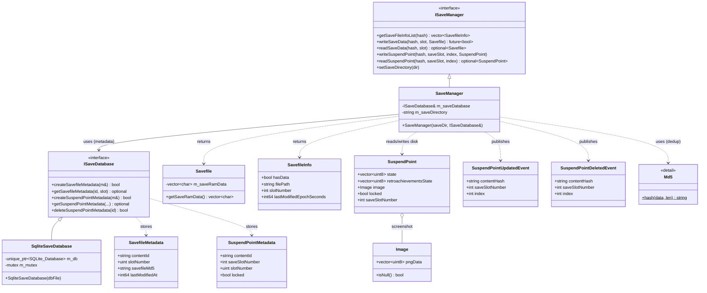

<!-- SCAFFOLD: the prose in this file was seeded from an automated read of the code so you can rewrite it in your own voice (see activity/ and achievements/ for the tone). The "How it works" bullets are the load-bearing facts that currently live only in comments — fold them into prose, then trim the inline comments. Delete this line when done. -->
# Firelight Saves Module
A Qt-free static library that persists emulator save data. It handles two things: battery/SRAM saves and suspend points (save states), which live as files on disk, plus a small SQLite index of metadata about those files (MD5 fingerprints, lock flags, timestamps). All QML/Qt bridging lives elsewhere (QtSaveManagerProxy in the app layer).

## How it works

---

**Entry point:** firelight::saves::ISaveManager (concrete impl: SaveManager)

<!-- Load-bearing facts (thread rules, invariants, protocol ordering, gotchas). Rewrite as prose. -->
- On-disk layout: SRAM lives at <saveDir>/<contentHash>/slot<N>/savefile.srm; a suspend point lives at <saveDir>/<contentHash>/slot<saveSlot>/suspendpoints/slot<slotNumber>/ with files suspendpoint.state, screenshot.png, and rcheevos.state. The public 'index' arg maps to on-disk slotNumber = index + 1.
- TIMESTAMP UNIT MISMATCH: SavefileMetadata/SuspendPointMetadata timestamps are int64 MILLISECONDS since the Unix epoch, but SavefileInfo.lastModifiedEpochSeconds is SECONDS (computed as fileMtimeMs()/1000). Easy to conflate.
- Save dedup: writeSaveData MD5-hashes the incoming bytes and, if the hash equals the stored savefileMd5, it skips the disk write entirely and returns true. MD5 is used only for change detection, never security.
- Atomic writes: all file writes go through writeAtomic() (write to <path>.tmp, then rename) so a partial/failed write can never corrupt a previously-good file.
- writeSaveData runs on a background thread (std::async, std::launch::async) and returns std::future<bool>; the Savefile is captured by value into the lambda. Callers must keep the future alive or the async op blocks in the future's destructor.
- Partial-failure contract: if the SRAM bytes are written to disk successfully but the metadata DB write fails, writeSaveData logs a warning and STILL returns true — the save data is considered safe on disk; only the index is stale.
- Locked suspend points are write-protected: writeSuspendPointToDisk early-returns (with a warning) if suspendPoint.locked is true. On read, the locked flag is sourced from DB metadata, not from disk.
- stripFileUrl() strips a file:// scheme but must NOT strip the leading '/' of a POSIX absolute path (a prior bug turned /Users/x into Users/x); it removes the leading slash only for a Windows drive path like /C:/... This runs on every setSaveDirectory().
- The save directory is held in memory only (m_saveDirectory); persisting it across launches is the app layer's responsibility (QtSaveManagerProxy passes the resolved dir in). setSaveDirectory no-ops if unchanged.
- getSaveFileInfoList always returns exactly 8 entries (slots 1..8); missing slots come back as {hasData:false, slotNumber:N} placeholders rather than being omitted.
- SqliteSaveDatabase uses ONE connection guarded by std::mutex on every method, enabling cross-thread sharing; PRAGMA journal_mode=WAL and synchronous=NORMAL are set at construction. Tables are created lazily via CREATE TABLE IF NOT EXISTS.
- SCHEMA QUIRK: suspend_point_metadata has UNIQUE(content_id, slot_number) — it does NOT include save_slot_number, even though every query filters by save_slot_number. Two different save slots sharing the same suspend slot_number could collide on insert.
- fileMtimeMs() does a manual filesystem-clock -> system-clock conversion (offset math) rather than std::chrono::clock_cast because clock_cast support is uneven across the toolchains the project builds on (Windows/MinGW + macOS).
- Suspend-point change notification was migrated OFF Qt signals: SaveManager now publishes SuspendPointUpdatedEvent/DeletedEvent through the global EventDispatcher (firelight/event_dispatcher.hpp), delivered synchronously on the calling thread. This is why the whole lib is Qt-free (AUTOMOC OFF, no QObjects).
- SuspendPoint is intentionally declared in the GLOBAL namespace (not firelight::saves) and uses firelight::Image (raw PNG bytes) instead of QImage so domain consumers don't pull in Qt6::Gui; the GUI converts to/from QImage at the boundary (src/gui/image_qt.hpp).

## Architecture

---

Draft was accurate: all 12 claimed types plus firelight::Image exist and are correctly classified; no public class/struct/enum is missing (module has no enums). All relationships verified correct in kind and direction against source: SaveManager final:public ISaveManager and SqliteSaveDatabase final:public ISaveDatabase (inheritance); ISaveDatabase& m_saveDatabase reference member (-->); detail::Md5::hash dedup, Savefile/SavefileInfo returns, SuspendPoint disk I/O, and event publishing via EventDispatcher::instance().publish(...) (dependencies); SuspendPoint holds firelight::Image by value (o-- holds-a-copy). Entry point firelight::saves::ISaveManager with concrete SaveManager holds up (sole final impl). Mermaid is syntactically valid and renders on GitHub. Non-diagram note: SuspendPoint (suspend_point.hpp) is declared in the GLOBAL namespace, not firelight::saves like every other type in the module -- structure is unaffected but worth noting for consumers.

## Data Structures

---

### ISaveManager _(interface)_
The save/suspend-point persistence contract. A plain domain interface carrying no Qt concerns — the app implements notification separately (QtSaveManagerProxy for the save-dir binding, EventDispatcher for suspend-point changes). Content hashes and the save directory are std::string.

### SaveManager _(class)_
The concrete, Qt-free SaveManager (final). Reads/writes SRAM and suspend-point files under saveDir/<contentHash>/slot<N>/..., dedups saves by MD5, delegates all metadata to an injected ISaveDatabase, and announces suspend-point changes via EventDispatcher. Holds the save directory in memory only; persisting that setting is the app layer's job.

### ISaveDatabase _(interface)_
Persistence contract for the save/suspend-point metadata index. Qt-free so it can be used from the save worker thread. CRUD over SavefileMetadata and SuspendPointMetadata rows.

### SqliteSaveDatabase _(class)_
SQLiteCpp-backed implementation of ISaveDatabase (final). Creates the savefile_metadata and suspend_point_metadata tables on construction; one mutex-guarded connection shared across threads. WAL + synchronous=NORMAL.

### Savefile _(class)_
Value object wrapping a game's raw SRAM byte buffer (vector<char>). Copyable; the bytes are what get written to savefile.srm on disk. (Has an unused m_contentId field.)

### SavefileInfo _(struct)_
Per-slot listing DTO returned to the UI. getSaveFileInfoList always returns exactly 8 of these (slots 1..8), with hasData=false placeholders for empty slots. NOTE lastModifiedEpochSeconds is in SECONDS, unlike the millisecond timestamps in the metadata structs.

### SavefileMetadata _(struct)_
Index row for a battery/SRAM save (bytes live on disk as savefile.srm). Timestamps are int64 MILLISECONDS since the Unix epoch. Carries the MD5 used to skip redundant writes.

### SuspendPoint _(struct)_
In-memory save state passed across the API. Bundles the emulator state bytes, the rcheevos state bytes, a PNG screenshot (firelight::Image), a lock flag, and the save-slot number. Declared in the GLOBAL namespace (not firelight::saves) as a boundary type shared with media/screenshot code.

### SuspendPointMetadata _(struct)_
Index row for a suspend point. State bytes live on disk; this row carries the lock flag and int64-millisecond timestamps. Has both saveSlotNumber and slotNumber.

### SuspendPointUpdatedEvent _(struct)_
Domain event published through the global EventDispatcher when a suspend point is written (replaces the old Qt signal on ISaveManager). Consumed by the app's suspend-point UI. Synchronous same-thread delivery.

### SuspendPointDeletedEvent _(struct)_
Domain event published through EventDispatcher when a suspend point is deleted. Same delivery semantics as the updated event.

### Md5 _(class)_
Compact dependency-free MD5 (firelight::saves::detail, private src header). Replaces QCryptographicHash purely for the savefile dedup fingerprint — used only to detect unchanged bytes and skip a redundant write, NOT for security.
