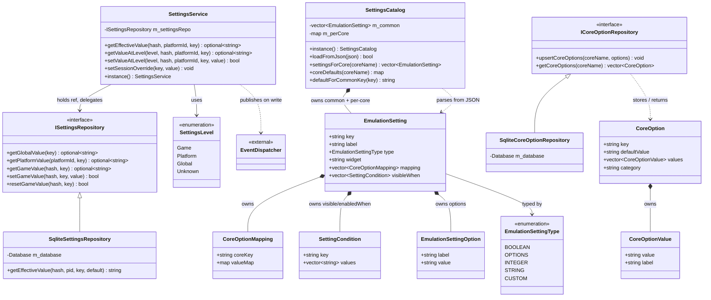

<!-- SCAFFOLD: the prose in this file was seeded from an automated read of the code so you can rewrite it in your own voice (see activity/ and achievements/ for the tone). The "How it works" bullets are the load-bearing facts that currently live only in comments — fold them into prose, then trim the inline comments. Delete this line when done. -->
# Firelight Settings Module
A Qt-free static lib that models Firelight's emulation settings: a declarative catalog of "friendly" settings and their libretro core-option mappings, plus three-tier (game/platform/global) persistence with a session-override layer on top. It resolves the effective value of any setting and lets the UI render both friendly and raw core options.

## How it works

---

**Entry point:** SettingsService

<!-- Load-bearing facts (thread rules, invariants, protocol ordering, gotchas). Rewrite as prose. -->
- Effective-value resolution order is a fallback chain with NO stored 'current level': session (CLI, in-memory) override -> game override -> platform override -> global -> catalog default. SettingsService::getEffectiveValue returns nullopt if unset at every stored tier and the CALLER applies the catalog default (SqliteSettingsRepository has its own getEffectiveValue variant that folds a passed-in default instead, but the app path uses the service's).
- Session overrides (setSessionOverride) are in-memory and NEVER persisted; they win over every stored tier. Contract: populate once at startup before any game loads (CLI `--set`) and do not mutate afterward — there is no locking.
- Settings are keyed by CORE, not by platform, because libretro core-option keys differ per core; a platform later run by a different core gets a different set. 'common' settings are frontend concepts (rewind, aspect ratio) that apply to every core.
- SettingsService only publishes an EventDispatcher event when the underlying repository write actually succeeds (each set/reset checks the bool result first).
- getValueAtLevel reads the value stored at EXACTLY that level (no fallback) — used to detect whether a tier has its own override; getEffectiveValue is the one that walks the fallback chain. Don't conflate them.
- game_settings has a platform_id column but SqliteSettingsRepository always binds platform_id = -1 for game-tier get/set/reset — the game tier is effectively (content_hash, key) and ignores platform. The column exists in the primary key but is a fixed sentinel in practice.
- SqliteCoreOptionRepository::upsertCoreOptions is REPLACE-ALL within a transaction (DELETE the core's rows, then re-INSERT): options a core no longer declares must disappear from the cache. A `position` column preserves declaration order, which getCoreOptions restores via ORDER BY position.
- SqliteCoreOptionRepository runs a manual migration: CREATE TABLE IF NOT EXISTS won't add columns to a pre-existing table, so it PRAGMA-checks and ALTER TABLE-adds category_key/category_label; without this, reads/writes referencing those columns fail on older DBs.
- CoreOption definitions are cached per-core so the advanced options editor can render BEFORE that core has been launched in the current session.
- EmulationSetting.widget being empty means the control is derived from `type` (toggle/dropdown/slider); a non-empty widget overrides it, and for CUSTOM it is a bespoke QML delegate id (e.g. 'gbc-palette'). This keeps custom widgets open-ended without schema churn.
- EmulationSetting.mapping empty => the setting is frontend-only (consumed by EmulatorInstance) OR its `key` is itself the core option key (identity). CoreOptionMapping.valueMap empty likewise means identity (friendly value written through unchanged).
- libraryGameSource settings (type 'game-picker') have their `options` filled at RUNTIME by the app layer from the user's library, because the settings lib deliberately has no library dependency; the stored value is the chosen game's content hash, filtered by gamePickerPlatformIds.
- SettingCondition semantics: an empty condition list always holds (always visible/enabled); multiple clauses on one setting are AND-ed; each clause holds when the referenced setting's current value is one of its `values`.
- SettingsCatalog::instance() and loadFromJson: the catalog is a single shared singleton loaded once at startup and read by both the emulation path and the settings UI. It starts empty; a parse error logs and leaves the previous catalog intact (returns false). Tests that never load it see an empty catalog and fall back to core-declared defaults.
- The module is intentionally Qt-free (no Q_OBJECT), so CMake explicitly sets AUTOMOC OFF on firelight_settings — it inherits ON from the parent and would otherwise create an empty-autogen dependency cycle.

## Architecture

---

Entry point SettingsService confirmed as the app/QML-facing facade; the two SQLite repositories sit behind the ISettingsRepository / ICoreOptionRepository interfaces. EventDispatcher is external to the module (firelight/event_dispatcher.hpp) and is correctly marked <<external>>; SettingsService.getEffectiveValue resolves session override -> game -> platform -> global (nullopt if unset, caller applies catalog default). SettingsLevel is an unscoped enum with a Unknown sentinel. Two edges are intentionally drawn between SettingsCatalog and EmulationSetting (structural composition of m_common/m_perCore, plus a behavioral 'parses from JSON' dependency for loadFromJson); both render on GitHub.

## Data Structures

---

### SettingsService _(class)_
The runtime facade and the module entrypoint. Wraps an ISettingsRepository, adds an in-memory session-override tier, resolves effective values across tiers, and publishes change/reset events on the global EventDispatcher after every successful write. The QML layer talks to this, never to the repository directly.

### ISettingsRepository _(interface)_
Persistence contract for the three stored tiers (global, platform, game), each with get/set/reset. std-typed, Qt-free.

### SqliteSettingsRepository _(class)_
SQLite-backed ISettingsRepository. Creates global_settings, platform_settings, and game_settings tables on construction. Also offers a convenience getEffectiveValue(...) that folds in a caller-supplied catalog default (distinct from SettingsService's, which folds in session overrides instead).

### SettingsLevel _(enum)_
The override tier a value lives at: Game, Platform, Global, plus Unknown as a not-a-real-tier sentinel. There is no stored 'current level' — inheritance is purely a fallback chain.

### SettingsCatalog _(class)_
Process-wide singleton holding the declarative schema of settings, authored as JSON. Splits into 'common' frontend settings (rewind, aspect ratio, ...) that apply to every core and per-core friendly settings + Firelight's opinionated raw core-option default overrides. Settings are keyed by CORE, not platform. Loads once at startup; empty catalog is valid (callers fall back to core-declared defaults).

### EmulationSetting _(struct)_
One friendly, author-facing setting. Carries value semantics (type), a chosen UI widget id, INTEGER range, its mapping to zero-or-more raw core options, and inter-setting visibleWhen/enabledWhen dependency clauses. Also flags advanced-only, restart-required, library-game-source, and file/folder-picker behavior.

### EmulationSettingType _(enum)_
Value semantics of a setting, chosen independently of the concrete UI widget (so an INTEGER can be a slider or spinbox, a CUSTOM one a bespoke delegate). STRING is any free-form string (text/color/path).

### CoreOptionMapping _(struct)_
Maps one friendly setting onto one libretro core option (coreKey) with a friendlyValue->coreValue table. An empty valueMap means identity (write the friendly value through unchanged). A friendly setting may hold several of these (composite: one control drives multiple core options).

### SettingCondition _(struct)_
A dependency clause: holds when the referenced setting currently has one of `values`. Multiple clauses on a setting are AND-ed. Evaluated by the free helper conditionsHold via a SettingValueResolver callback.

### ICoreOptionRepository _(interface)_
Persists the RAW option definitions a core declares at load (SET_CORE_OPTIONS_V2), keyed by core name, so the advanced options editor can list options before a core has run this session.

### SqliteCoreOptionRepository _(class)_
SQLite-backed ICoreOptionRepository. Stores options in a core_options table with a position column to preserve declaration order and serializes each option's values to a values_json blob. Includes a runtime ALTER-TABLE migration to add category columns to old DBs.

### CoreOption _(struct)_
A raw libretro core option exactly as the core declares it — key, label, description, default, its selectable values, and core-options-v2 category grouping. Cached per core.

### CoreOptionValue _(struct)_
One selectable value/label pair of a raw core option.

### EmulationSetting free helpers _(free-functions)_
Header-inline logic operating on EmulationSetting/SettingCondition: conditionsHold, settingIsVisible, settingIsEnabled (evaluate dependency clauses via a SettingValueResolver), and resolveCoreOptionValues (turn a friendly value into concrete (coreKey, coreValue) pairs through the setting's mapping).

### Setting change events _(struct)_
POD payloads published on the EventDispatcher by SettingsService when a value changes or resets at a tier (Game/Platform/Global variants), plus EmulationSettingChangedEvent. Consumers (e.g. the emulation path) react to these.
